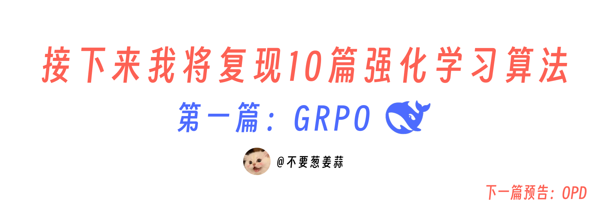
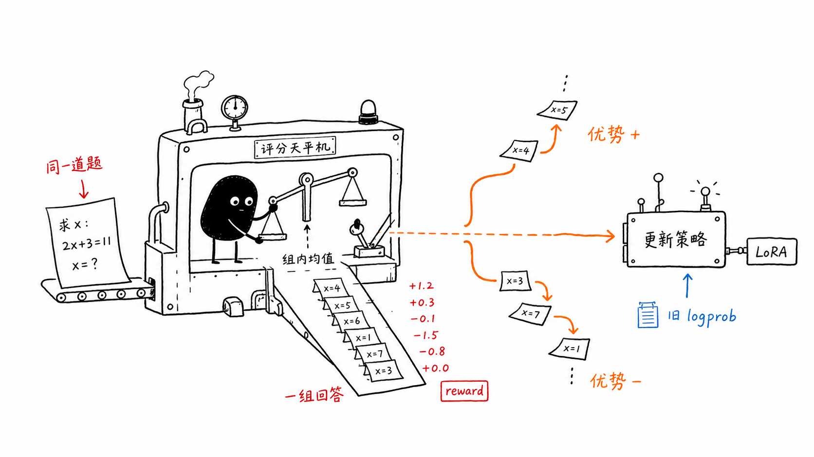
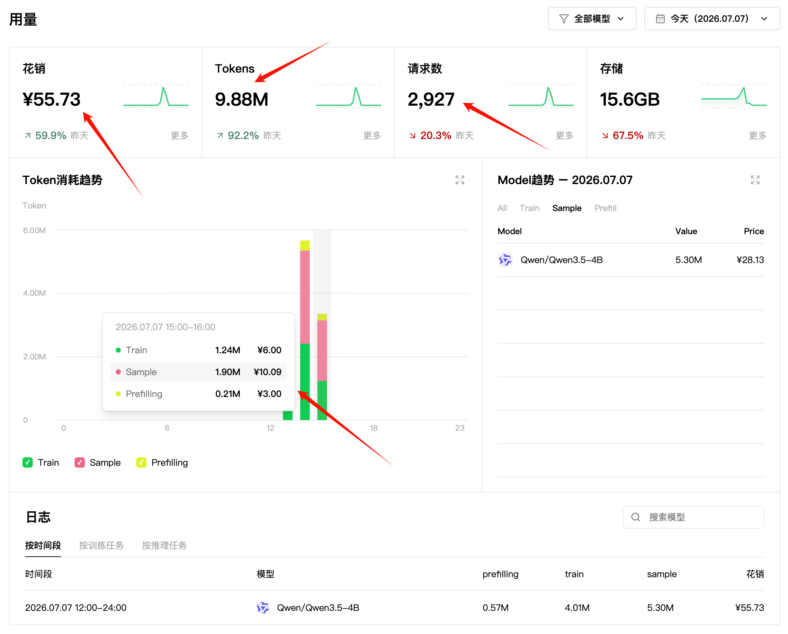
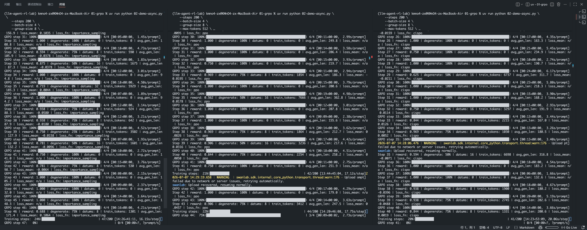
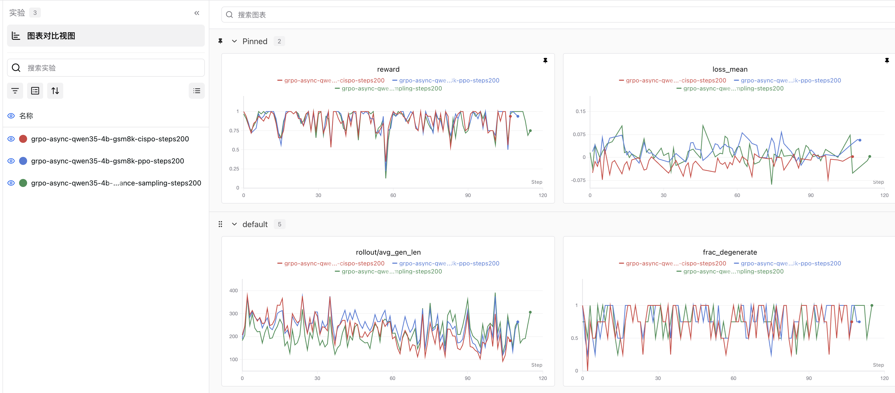

# 接下来我将复现 10 篇强化学习算法：第 1 篇，关于 GRPO（完整代码）

上一篇我先写了强化学习里几个常见 loss 的直觉：`importance_sampling`、`ppo`、`cispo` 到底在优化什么。今天开始正式进入“接下来我将复现 10 篇强化学习论文”这个系列，第一篇先写 GRPO。



下一篇会写 OPD，也就是 On-Policy Distillation。它和 GRPO 很像，都是拿当前策略自己采样出来的轨迹继续训练；区别是 GRPO 的信号来自 reward，OPD 的信号来自 teacher 对 student 轨迹的评价。这个我们下一篇再详细的解释。

这件事很适合用 PyTRIO 做。传统上你当然可以拉一台 8 卡机器，自己把训练、采样、权重同步、日志和 checkpoint 全部接起来。问题是，如果我今天只是想比较 3 个 loss 的差异呢？如果明天还想把 `group_size`、学习率、clip 阈值组合成 10 组参数一起跑呢？这时候最大的成本不再是“会不会写 GRPO”，而是你要一直照顾 infra 和 trainer。

PyTRIO 的好处就在这里：本地只写数据、reward、loss 和实验循环；前向、反向、优化器更新、LoRA 权重保存、采样服务都交给远端。这样我就可以更像做实验，而不是先搭一套训练平台。

## GRPO 是从哪里来的？

GRPO，全称 Group Relative Policy Optimization，最早是在 2024 年 DeepSeek-AI 的 DeepSeekMath 论文里系统提出的：

> DeepSeekMath: Pushing the Limits of Mathematical Reasoning in Open Language Models

论文地址：https://arxiv.org/abs/2402.03300

这篇论文的主线是把 DeepSeek-Coder-Base-v1.5 7B 继续用数学数据预训练，得到 DeepSeekMath，然后再做 instruction tuning 和 RL。GRPO 出现在强化学习阶段，用来进一步提升数学推理能力。

为什么要提出 GRPO？一句话：PPO 好用，但太重。

PPO 是 actor-critic 方法。除了 policy model，还要训练一个 value model 来估计 baseline。对于 LLM 来说，这个 value model 往往也是一个很大的模型，显存和计算都会上去。而且数学题这类任务经常只有最后答案能打分，想让 value model 给每个 token 都估得很准，也不是一件自然的事。

GRPO 的思路很直接：

1. 对同一个问题，采样一组回答。
2. 给每个回答打 reward。
3. 不再额外训练 value model，而是用这一组回答的平均 reward 当 baseline。
4. 比组内平均分高的回答，advantage 为正；低的为负。
5. 用这个 advantage 去更新 policy。



用公式写就是：

$$
A_i = r_i - \mathrm{mean}(r_1, r_2, \ldots, r_G)
$$

论文里通常还会除以组内标准差，做标准化：

$$
A_i = \frac{r_i - \mathrm{mean}(r_1, r_2, \ldots, r_G)}{\mathrm{std}(r_1, r_2, \ldots, r_G)}
$$

这份 demo 为了保持逻辑清楚，只用了 `reward - mean_reward`。对于 GSM8K 这种 0/1 reward 的小实验，这已经足够把 GRPO 的核心跑起来：同一道题里，相对更好的答案被鼓励，相对更差的答案被压低。

## 这次复现什么？

代码在这里：https://github.com/KMnO4-zx/llm-agent-rl-lab

注册 PyTRIO 账号和 SwanLab，就能直接跑。

如果是直接 clone 这个仓库，依赖已经写在 `pyproject.toml` 里了：

```bash
uv sync
```

如果你只是想把这个脚本拎到自己的项目里跑，需要的包也不多：

```bash
uv add "datasets>=5.0.0" "numpy>=2.5.1" "pytrio>=0.2.0" "swanlab>=0.8.4" "torch>=2.12.1" "tqdm>=4.68.3"
```

不用 `uv` 的话，也可以直接：

```bash
pip install "datasets>=5.0.0" "numpy>=2.5.1" "pytrio>=0.2.0" "swanlab>=0.8.4" "torch>=2.12.1" "tqdm>=4.68.3"
```

PyTRIO：https://pytrio.cn/

SwanLab：https://swanlab.cn/

今天调试这个代码，一共花了 55 块钱，如果只跑 10 步，成本可以低到 5 块钱叭，成本还挺低的。你可以先跑一个小 batch，看看脚本能不能走通，再慢慢调参数。



```text
01-grpo/01-demo-sync.py
01-grpo/02-demo-async.py
```

这一篇主要讲同步版 `01-demo-sync.py`。异步版做的是同一件事，只是把 batch 内每道题的 rollout 并发提交出去，更适合正式跑实验。

这个 demo 的任务是 GSM8K 数学题。流程是：

1. 从 GSM8K train split 取一批题。
2. 把每道题渲染成 chat prompt。
3. 用当前 LoRA 权重保存出一个 sampler。
4. 对同一道题采样 `group_size` 个回答。
5. 从回答里抽取最后一个 `\boxed{...}`。
6. 和 GSM8K 标准答案比较，答对 reward = 1，答错 reward = 0。
7. 在同一题的 group 内计算 advantage。
8. 构造 PyTRIO 的 `Datum`。
9. 用 `importance_sampling` / `ppo` / `cispo` 之一更新模型。
10. 记录 SwanLab，最后保存 LoRA 权重。

可以先跑一个成本比较低的版本：

```bash
trio login

uv run python 01-grpo/01-demo-sync.py \
  --steps 10 \
  --batch-size 4 \
  --group-size 8 \
  --max-tokens 512 \
  --loss-fn importance_sampling \
  --swanlab-mode online
```

如果只是检查脚本是否能走通，可以先关掉 SwanLab：

```bash
uv run python 01-grpo/01-demo-sync.py \
  --steps 1 \
  --batch-size 2 \
  --group-size 2 \
  --max-tokens 64 \
  --loss-fn importance_sampling \
  --swanlab-mode disabled
```



## 第一步：准备 prompt 和 reward

GRPO 不规定 reward 必须怎么写。它只关心一件事：给同一个 prompt 的多个回答打分，然后在组内比较。

这份代码里，prompt 会要求模型把最终答案写进 `\boxed{}`：

```python
QUESTION_SUFFIX = " Provide a numerical answer without units, written inside \\boxed{}."
```

为了让模型更稳定地按格式回答，代码前面加了一个很小的 few-shot 示例：

```python
FEWSHOT_PREFIX = [
    {"role": "user", "content": "How many r's are in strawberry?" + QUESTION_SUFFIX},
    {
        "role": "assistant",
        "content": (
            "<think>\n\n</think>\n\n"
            "Let's spell the word out and number all the letters: "
            "1) s 2) t 3) r 4) a 5) w 6) b 7) e 8) r 9) r 10) y. "
            "We have r's at positions 3, 8, and 9. "
            "There are three r's. \\boxed{3}"
        ),
    },
]
```

真正构造 prompt 的函数很短：

```python
def build_prompt(tokenizer: Any, question: str) -> list[int]:
    messages = [
        *FEWSHOT_PREFIX,
        {"role": "user", "content": question + QUESTION_SUFFIX},
    ]
    prompt_text = tokenizer.apply_chat_template(
        messages,
        tokenize=False,
        add_generation_prompt=True,
        enable_thinking=False,
    )
    prompt_tokens = tokenizer.encode(prompt_text, add_special_tokens=False)
    if not prompt_tokens:
        raise ValueError("Prompt tokens are empty")
    return prompt_tokens
```

reward 也故意写得很朴素。只取最后一个 `\boxed{...}`，和标准答案一致就给 1，否则给 0：

```python
def extract_boxed(text: str) -> str | None:
    matches = re.findall(r"\\boxed\{([^}]+)\}", text)
    if not matches:
        return None
    return matches[-1].strip()


def grade_answer(response: str, ground_truth: str) -> float:
    answer = extract_boxed(response)
    if answer is None:
        return 0.0
    return 1.0 if normalize_answer(answer) == normalize_answer(ground_truth) else 0.0
```

这也是 RLVR，也就是 Reinforcement Learning with Verifiable Rewards，最舒服的地方：不需要先训练一个 reward model。数学题、代码题、格式校验、工具调用成功率，只要能写出可验证的打分函数，就能先把强化学习循环跑起来。

## 第二步：用当前策略采样一组回答

GRPO 的采样不是“每道题只生成一个答案”。它必须对同一个 prompt 采样多个 completion。因为 advantage 是组内相对值，只有一个回答就没法比较。

同步版里核心函数是 `run_rollout_group`：

```python
def run_rollout_group(
    sampling_client: Any,
    tokenizer: Any,
    prompt_tokens: list[int],
    ground_truth: str,
    sampling_params: trio.SamplingParams,
    group_size: int,
) -> list[RolloutSample]:
    result = sampling_client.sample(
        prompt=trio.ModelInput.from_ints(prompt_tokens),
        num_samples=group_size,
        sampling_params=sampling_params,
        return_text=True,
    ).result()
```

这里有两个细节很重要。

第一，采样用的是 `sampling_client`，不是 `training_client`。在每个 step 里，代码都会先从当前 LoRA 权重保存出一个 sampler：

```python
sampling_client = training_client.save_weights_and_get_sampling_client()
```

这一步的含义是：现在这个 sampler 就是 old policy。后面构造 loss 时用到的 `logprobs`，必须来自这个 old policy 当时采样的结果。不能等模型更新后再重算一遍糊弄过去。

第二，`num_samples=group_size` 表示同一道题一次取多个回答。拿到结果后，代码会保存三样东西：

```python
tokens = list(sequence.tokens)
logprobs = [float(value) for value in sequence.logprobs]
reward = grade_answer(text, ground_truth)
```

`tokens` 是模型生成的 completion token。

`logprobs` 是 old policy 采样时对这些 token 的 log probability。

`reward` 是我们本地打出来的分数。

这三样东西加起来，就是后面训练所需的原材料。

## 第三步：计算 group-relative advantage

同一道题的所有回答都打完分以后，才计算 advantage：

```python
mean_reward = sum(rewards) / len(rewards)
return [
    RolloutSample(
        tokens=tokens,
        logprobs=logprobs,
        text=text,
        reward=reward,
        advantage=reward - mean_reward,
    )
    for (tokens, logprobs, text), reward in zip(raw_samples, rewards, strict=True)
]
```

举个例子，假设某道题采样 4 个回答，reward 是：

```text
[1, 0, 1, 0]
```

组内平均分是 `0.5`，那么 advantage 就是：

```text
[+0.5, -0.5, +0.5, -0.5]
```

这就是 GRPO 的核心味道：不是“答对就加分”这么粗，而是“在同一道题的这一组回答里，你比平均水平好还是差”。

如果某一组 reward 全都一样，比如：

```text
[0, 0, 0, 0]
```

或者：

```text
[1, 1, 1, 1]
```

那么所有 advantage 都是 0，这一组没有训练信号。代码里会直接跳过：

```python
if all(sample.advantage == 0.0 for sample in rollout_samples):
    n_degenerate += 1
    continue
```

这也是我建议记录 `frac_degenerate` 的原因。它越高，说明这个 batch 里真正能给 GRPO 提供相对优劣信号的题越少。模型太弱时经常全错，模型太强时也可能全对，这两种情况对 GRPO 都不太友好。

## 第四步：把 rollout 转成 PyTRIO Datum

PyTRIO 的内置 `importance_sampling` 和 `ppo` loss 需要三类输入：

```text
target_tokens
logprobs
advantages
```

它们都要和 `model_input` 严格等长。

代码在 `build_grpo_datum` 里做这件事：

```python
def build_grpo_datum(prompt_tokens: list[int], sample: RolloutSample) -> trio.Datum:
    if not sample.tokens:
        raise ValueError("Cannot train on an empty completion")

    observation_len = len(prompt_tokens) - 1
    input_tokens = prompt_tokens + sample.tokens[:-1]
    target_tokens = [0] * observation_len + sample.tokens
    padded_logprobs = [0.0] * observation_len + sample.logprobs
    padded_advantages = [0.0] * observation_len + [sample.advantage] * len(sample.tokens)

    return trio.Datum(
        model_input=trio.ModelInput.from_ints(input_tokens),
        loss_fn_inputs={
            "target_tokens": np.asarray(target_tokens, dtype=np.int64),
            "logprobs": np.asarray(padded_logprobs, dtype=np.float32),
            "advantages": np.asarray(padded_advantages, dtype=np.float32),
        },
    )
```

这里最容易写错的是右移对齐。

语言模型训练永远是：用前面的 token 预测下一个 token。所以：

```text
model_input = prompt + completion[:-1]
target      =          completion
```

那 prompt 部分怎么办？prompt 是上下文，不是我们要强化学习的对象。代码用 0 占位：

```python
target_tokens = [0] * observation_len + sample.tokens
padded_logprobs = [0.0] * observation_len + sample.logprobs
padded_advantages = [0.0] * observation_len + [sample.advantage] * len(sample.tokens)
```

也就是说，只有 completion token 的 advantage 非零，prompt token 不参与训练。

这点非常关键。GRPO 不是在训练模型“背 prompt”，而是在训练模型：看到这个 prompt 后，下次更倾向于走向更高 reward 的 completion。

## 第五步：提交 forward/backward 和 optimizer step

收集完一个 batch 的 datums 后，训练部分其实很短：

```python
if config.loss_fn in BUILTIN_LOSS_FNS:
    fwd_bwd_future = training_client.forward_backward(
        datums,
        loss_fn=config.loss_fn,
    )
```

`BUILTIN_LOSS_FNS` 是：

```python
BUILTIN_LOSS_FNS = {"importance_sampling", "ppo"}
```

也就是说，`importance_sampling` 和 `ppo` 都能直接复用同一批 GRPO datum。区别不在 rollout，而在 loss 如何处理 `logprobs` 和 `advantages`。

然后做优化器更新：

```python
optim_future = training_client.optim_step(adam_params)
fwd_bwd_result = fwd_bwd_future.result()
optim_future.result()
loss_metrics = dict(fwd_bwd_result.metrics)
```

本地代码只是把训练任务提交给 PyTRIO。真正的模型前向、反向传播、LoRA 参数更新，都在远端完成。对我来说，这就是 PyTRIO 很适合写这类复现实验的原因：我可以把注意力放在算法变量上，比如 reward、advantage、loss、group size，而不是一直处理训练基础设施。

## 三个 loss 分别在优化什么？

这份 demo 的一个重点，是同一套 GRPO rollout 可以切换三个 loss：

```bash
--loss-fn importance_sampling
--loss-fn ppo
--loss-fn cispo
```

它们吃的数据是一样的：

```text
target_tokens: 模型实际生成的 token
logprobs:      old policy 采样这些 token 时的 logprob
advantages:    这条 completion 的组内相对好坏
```

区别在于怎么把这些东西变成梯度。

### 1. importance_sampling：最直接地推高好 token，压低坏 token

Importance Sampling 的直觉是：

```text
ratio = exp(current_logprob - old_logprob)
objective = ratio * advantage
```

如果 advantage 是正的，说明这条 completion 比同组平均更好。那就提高当前模型生成这些 token 的概率。

如果 advantage 是负的，说明这条 completion 比同组平均更差。那就降低当前模型生成这些 token 的概率。

这里的 `ratio` 用来修正“数据是 old policy 采样出来的，但我们正在训练 current policy”这件事。old policy 和 current policy 差得越多，ratio 就越偏离 1。

它的优点是直接，坏处也直接：没有 clip，策略可能更新得比较猛。小实验里这很方便，因为我们能清楚看到 reward 信号怎么进到 loss；正式训练时通常要更小心。

### 2. ppo：目标还是一样，但给策略更新加限速

PPO 仍然在做这件事：

```text
让高 advantage token 概率上去，让低 advantage token 概率下来
```

但它会对 ratio 做 clip。直觉上，如果 current policy 已经比 old policy 更喜欢某个 token 很多，就不要继续按原来的力度猛推。

可以把 PPO 想成带限速的 importance sampling：

```text
unclipped = ratio * advantage
clipped   = clip(ratio, 1 - eps, 1 + eps) * advantage
objective = min(unclipped, clipped)
```

所以 PPO 优化的目标是：在不让当前策略离 old policy 太远的前提下，最大化 advantage 加权后的生成概率。

这也是为什么很多 RLHF / RLVR 系统会偏向 PPO 或 PPO 变体。它不是最简单的，但稳定性通常更好。

### 3. cispo：把 clipped ratio 当固定权重，真正优化 logprob

`cispo` 在这份 demo 里不是 PyTRIO 内置 loss，而是用 custom loss 写出来的。代码里的核心公式是：

```python
prob_ratio = torch.exp(target_logprobs - sampling_logprobs)
clipped_ratio = torch.clamp(
    prob_ratio,
    min=clip_low_threshold,
    max=clip_high_threshold,
)
cispo_objective = clipped_ratio.detach() * target_logprobs * advantages
loss = -cispo_objective.sum()
```

它和 PPO 的关键区别在 `.detach()`。

`clipped_ratio.detach()` 的意思是：ratio 可以影响这一项 loss 的权重，但它本身不再参与梯度回传。真正被优化的是 `target_logprobs`。

所以我会这样理解 CISPO：

```text
PPO:   clip objective，让目标本身更保守。
CISPO: clip ratio，把它当成固定砝码，控制每个 token 的学习力度。
```

这三者放在一起看：

| loss | 优化目标 | 稳定性手段 | 适合用来观察什么 |
| --- | --- | --- | --- |
| `importance_sampling` | 直接最大化 `ratio * advantage` | 没有明显限速 | reward 信号最直接怎么推动 token 概率 |
| `ppo` | 最大化 clipped surrogate objective | clip ratio 对策略更新限速 | 同样 reward 下，保守更新是否更稳 |
| `cispo` | 最大化 `detach(clipped_ratio) * logprob * advantage` | ratio clip 后只当固定权重 | custom loss 如何控制梯度形态 |

注意，这里比较的是 loss 目标，不是说某个一定更强。GRPO 这类实验非常吃 reward、数据难度、group size、采样温度、学习率和训练步数。也正因为变量很多，PyTRIO 的并行实验价值才会出来。

## 如何用 PyTRIO 实现自定义 loss？

这一节是我觉得最有意思的地方。

如果只跑内置 `importance_sampling` 或 `ppo`，我们直接把 datums 交给：

```python
training_client.forward_backward(datums, loss_fn=config.loss_fn)
```

但 `cispo` 不走内置 loss，而是走：

```python
training_client.forward_backward_custom(custom_datums, loss_fn)
```

PyTRIO custom loss 的分工是：

1. 远端模型负责 forward，算出当前模型对 `target_tokens` 的逐 token logprob。
2. 本地 Python 的 `loss_fn` 接收这些可求导 logprob。
3. 你用 torch 写任意 loss，返回 `(loss, metrics)`。
4. PyTRIO 根据这个 loss 做 backward 和参数更新。

也就是说，你不是在本地训练模型；你只是在本地定义“这些 logprob 应该怎么变成 loss”。

### 先把 Datum 变成 custom forward 需要的形态

内置 `importance_sampling` datum 里有：

```text
target_tokens
logprobs
advantages
```

但 custom forward 只需要模型重新计算当前策略的 `target_tokens` logprob，所以代码先做一次转换：

```python
def build_custom_forward_datum(datum: trio.Datum) -> trio.Datum:
    return trio.Datum(
        model_input=datum.model_input,
        loss_fn_inputs={
            "target_tokens": datum.loss_fn_inputs["target_tokens"],
        },
    )
```

old policy 的 logprobs 和 advantage 不能丢。它们会通过闭包传进 custom loss：

```python
sampling_logprobs_list = [
    get_float_tensor_values(datum, "logprobs") for datum in datums
]
advantages_list = [
    get_float_tensor_values(datum, "advantages") for datum in datums
]
```

### 再写 loss_fn

`make_cispo_loss_fn` 会返回一个真正交给 PyTRIO 的 `cispo_loss_fn`：

```python
def make_cispo_loss_fn(
    sampling_logprobs_list: list[list[float]],
    advantages_list: list[list[float]],
    clip_low_threshold: float,
    clip_high_threshold: float,
):
    def cispo_loss_fn(data, logprobs_list):
        datum_losses = []

        for target_logprobs, sampling_values, advantage_values in zip(
            logprobs_list,
            sampling_logprobs_list,
            advantages_list,
            strict=True,
        ):
            target_logprobs = target_logprobs.float()
            device = target_logprobs.device
            sampling_logprobs = torch.as_tensor(
                sampling_values,
                dtype=torch.float32,
                device=device,
            )
            advantages = torch.as_tensor(
                advantage_values,
                dtype=torch.float32,
                device=device,
            )

            prob_ratio = torch.exp(target_logprobs - sampling_logprobs)
            clipped_ratio = torch.clamp(
                prob_ratio,
                min=clip_low_threshold,
                max=clip_high_threshold,
            )
            cispo_objective = clipped_ratio.detach() * target_logprobs * advantages
            datum_losses.append(-cispo_objective.sum())

        loss = torch.stack(datum_losses).sum()
        return loss, {"loss_mean": float(loss.detach().item())}

    return cispo_loss_fn
```

真实代码里还多记了一些 metrics，比如：

```text
cispo/train_tokens
cispo/ratio_mean
cispo/clipped_ratio_mean
cispo/clip_fraction
```

这些指标很有用。比如 `clip_fraction` 高，说明很多 token 的 ratio 被 clip 了；这时你就要看学习率是不是太大、采样策略是不是和当前策略偏离太远。

最后提交：

```python
custom_datums = [build_custom_forward_datum(datum) for datum in datums]
fwd_bwd_future = training_client.forward_backward_custom(
    custom_datums,
    make_cispo_loss_fn(
        sampling_logprobs_list=sampling_logprobs_list,
        advantages_list=advantages_list,
        clip_low_threshold=config.cispo_clip_low_threshold,
        clip_high_threshold=config.cispo_clip_high_threshold,
    ),
)
```

这套写法的意义不止是 CISPO。以后想复现 DAPO、GSPO、Dr.GRPO，或者自己试一个新的 token-level weighting，本质都是同一条路：

```text
保留 rollout / reward / advantage 管线
替换 custom loss
用 SwanLab 对比实验
```

## 记录哪些指标？

代码里 SwanLab 记录的指标不多，但够用：

```python
log_payload = {
    "reward": mean_reward,
    "frac_degenerate": frac_degenerate,
    "rollout/avg_gen_len": avg_gen_len,
    "datums": len(datums),
    "train_tokens": train_tokens,
    ...
}
```

重点看这几个：

| 指标 | 含义 |
| --- | --- |
| `reward` | 当前 batch 每道题 group 平均 reward 的均值 |
| `frac_degenerate` | reward 全相同、没有训练信号的 group 比例 |
| `rollout/avg_gen_len` | 平均生成长度 |
| `datums` | 真正进入训练的 completion 数 |
| `train_tokens` | 非零 advantage token 数 |
| `loss_mean` | trainer 返回的平均 loss |
| `cispo/clip_fraction` | CISPO 中 ratio 被 clip 的比例 |

只看 reward 不够。比如 reward 没变，可能是训练没起效；也可能是 `frac_degenerate` 太高，压根没有多少有效样本；也可能是模型开始生成更长推理，短期 reward 还没体现出来。



## 怎么比较三个 loss？

最简单的方式，是其他参数固定，只换 `--loss-fn`。

```bash
uv run python 01-grpo/01-demo-sync.py \
  --steps 30 \
  --batch-size 4 \
  --group-size 8 \
  --max-tokens 512 \
  --loss-fn importance_sampling \
  --swanlab-mode online

uv run python 01-grpo/01-demo-sync.py \
  --steps 30 \
  --batch-size 4 \
  --group-size 8 \
  --max-tokens 512 \
  --loss-fn ppo \
  --swanlab-mode online

uv run python 01-grpo/01-demo-sync.py \
  --steps 30 \
  --batch-size 4 \
  --group-size 8 \
  --max-tokens 512 \
  --loss-fn cispo \
  --swanlab-mode online
```

如果要更严谨，可以再加几组参数：

```text
group_size: 4 / 8
learning_rate: 1e-5 / 4e-5 / 8e-5
temperature: 0.7 / 1.0
cispo_clip_high_threshold: 2.0 / 4.0
```

这正是我前面说的 PyTRIO 优势。单跑一个 GRPO demo，任何框架都可以。真正麻烦的是：我要同时评估 3 个 loss、10 组参数，还想把记录、权重、运行日志都留好。PyTRIO 把底层训练资源托管掉以后，本地实验就变成普通 Python 任务。你可以把不同配置开成多个进程，或者写一个简单的 launcher 批量跑，重点看 SwanLab 结果。

当然，这不代表资源是免费的。采样和训练仍然消耗远端算力。它的价值是你不需要自己维护 8 卡训练服务，也不用在每次改 loss 时重新处理训推一体、权重同步和 checkpoint 管理。

## 这份 demo 和论文版 GRPO 有哪些差异？

为了让第一篇足够清楚，我保留了几个简化。

第一，reward 是 rule-based 0/1 reward。DeepSeekMath 论文里还讨论 reward model、outcome supervision、process supervision 等设置。本文先从可验证 reward 入手，因为它最容易复现，也最适合数学题。

第二，advantage 只用了：

```text
reward - mean_reward
```

论文里会做组内标准化。后续如果要更贴近论文，可以改成：

```python
std_reward = np.std(rewards)
advantage = (reward - mean_reward) / (std_reward + 1e-8)
```

第三，这份代码没有显式加 reference KL。我们这里的重点是把 GRPO 的 rollout、advantage、loss 和 PyTRIO 训练链路讲清楚。要做更完整的论文复现，可以在 reward 或 custom loss 里加入 reference policy 的约束。

这些简化不影响第一篇的核心目的：把 GRPO 的训练逻辑跑通，并且把 loss 这个变量单独拎出来比较。

## 小结

GRPO 的关键不是“神秘的新 RL 算法”，而是一个很朴素的替换：

```text
PPO:  用 value model 估 baseline
GRPO: 用同一 prompt 下多个回答的组内平均分估 baseline
```

这让它特别适合数学题、代码题、工具调用这类可验证任务。只要你能写 reward，就可以先对同一个 prompt 采样一组回答，在组内算相对 advantage，然后用 policy gradient 类 loss 更新模型。

这篇文章对应的 PyTRIO 代码做了三件事：

1. 用 GSM8K + boxed answer reward 跑一个最小 GRPO。
2. 用同一套 rollout 数据比较 `importance_sampling`、`ppo`、`cispo`。
3. 用 `forward_backward_custom` 演示如何在 PyTRIO 里写自己的 loss。

下一篇 OPD 会把 reward 换成 teacher 信号。到时候我们不再问“这个答案答对了吗”，而是问“student 走出来的这条轨迹，teacher 是否更认可”。这会更接近蒸馏，也更适合没有标准答案但有强 teacher 的任务。
