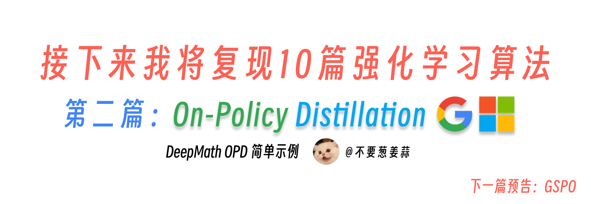

# 通用 On-policy Distillation（OPD）教程



> **代码与复现资源**
>
> - 开源仓库：[KMnO4-zx/llm-agent-rl-lab](https://github.com/KMnO4-zx/llm-agent-rl-lab)
> - 同步版代码：[01-demo-sync.py](https://github.com/KMnO4-zx/llm-agent-rl-lab/blob/main/03-opd/general-opd/01-demo-sync.py)
> - 异步版代码：[02-demo-async.py](https://github.com/KMnO4-zx/llm-agent-rl-lab/blob/main/03-opd/general-opd/02-demo-async.py)
> - PyTRIO 官网与注册入口：[https://pytrio.cn/](https://pytrio.cn/)（远程训练、采样与权重保存）
> - SwanLab 注册入口：[https://swanlab.cn/login](https://swanlab.cn/login)（训练过程与实验指标记录）
> - DeepMath-103K 数据集：[AI-ModelScope/DeepMath-103K](https://modelscope.cn/datasets/AI-ModelScope/DeepMath-103K)
> - PyTRIO Skill：[SwanHubX/pytrio-skill](https://github.com/SwanHubX/pytrio-skill)
> - SwanLab Skill：[SwanHubX/swanlab-skill](https://github.com/SwanHubX/swanlab-skill)

On-policy Distillation（OPD，在线策略蒸馏）可以看作知识蒸馏在自回归生成模型上的一次重要演进。传统蒸馏通常让学生模型学习固定数据或老师预先生成的答案，但学生真正推理时会进入自己的生成分布，训练与推理之间因此容易出现偏移。2023 年的 [Generalized Knowledge Distillation（GKD）](https://arxiv.org/abs/2306.13649) 明确提出让学生在自己生成的序列上接受老师反馈；同一时期的 [MiniLLM](https://arxiv.org/abs/2306.08543) 则系统研究了更适合生成式模型的 reverse KL。今天常说的 OPD，通常就是把这两个关键思想结合起来：轨迹由当前学生生成，老师只负责评价这些轨迹，再用反向 KL 把学生拉向老师。

这个代码我用 [PyTRIO](https://pytrio.cn/) 来写的，原因很直接：OPD 最麻烦的地方，是 student 采样之后，还要让 teacher 给同一条 token 轨迹重新打分。PyTRIO 正好提供了 `sample()` 和 [`compute_logprobs()`](https://docs.pytrio.cn/docs/advanced/compute_logprobs)。其中 `compute_logprobs()` 不会让 teacher 重新生成答案，而是直接接收 `prompt + student completion`，返回和输入 token 一一对应的 logprobs。所以我们不需要自己部署训练和推理服务，只要在本地算 reverse KL、构造 advantage，再调用 `forward_backward()` 和 `optim_step()`，就能把 OPD 跑起来。而且 PyTrio 有 [PyTrio Skill](https://github.com/SwanHubX/pytrio-skill) 加持，我只需要把我的训练逻辑讲清楚，Codex 或 Claude code 就可以使用 PyTrio Skill 来帮我写好一份 Demo 代码，然后我再来 review 代码、改成我想要的样子。

一次 OPD 训练的流程是：先从数据集中取出 prompt，再用当前 student 采样 completion，并保存每个 completion token 的旧策略 logprob；随后 teacher 不重新回答问题，而是对 `prompt + student completion` 这条完全相同的轨迹计算逐 token logprob；两者相减得到 `reverse_kl = student_logprob - teacher_logprob`，再把 `-reverse_kl` 作为 advantage，通过 importance sampling 更新 student。更新完成后重新导出 student sampler，进入下一轮采样，整个过程形成“学生生成—老师打分—学生更新”的 on-policy 闭环。


## 一句话理解 OPD

OPD 并不是让学生背老师提前写好的答案（这是 SFT 的逻辑），是让学生先暴露自己当前最可能犯的错误，再让老师沿着这些错误实际出现的路径逐 token 纠正它（相比 SFT 来说 OPD 的训练信号更加的“柔和”）。

| 对比项 | 传统离线蒸馏 | On-policy Distillation |
| --- | --- | --- |
| 训练 completion 来自哪里 | 固定数据或 teacher 预生成 | 当前 student 实时采样 |
| teacher 做什么 | 生成目标答案或提供固定 soft target | 给 student 的实际轨迹计算 logprob |
| student 学到什么 | 数据分布中的 teacher 行为 | 自己当前会访问到的状态中的 teacher 偏好 |
| 主要优点 | 简单、稳定、可提前准备数据 | 缓解训练与推理的分布偏移 |
| 主要成本 | 需要准备蒸馏数据 | 每轮都需要 student 采样和 teacher 打分 |

这里的 **on-policy** 指轨迹来自当前 student。teacher 可以比 student 大，也可以是经过专门训练的同尺寸模型；关键不是模型大小，而是 teacher 能否对 student 使用的 token 序列给出可靠、对齐的 logprob。

> 其中重要的一点是，student model 和 teacher model 必须共享兼容的 tokenizer。因为 OPD 训练信号是 token 级别的 logprob 差值，如果两者 tokenizer 不兼容，就无法直接比较相同 token ID 下的 logprob。

## OPD 的核心目标

设：

- $x$ 是 prompt；
- $y$ 是 student 采样出的 completion；
- $\pi_\theta$ 是正在训练的 student；
- $\pi_T$ 是冻结的 teacher。

OPD 常用的目标是最小化 student 到 teacher 的 reverse KL：

$$
D_{\mathrm{KL}}\left(\pi_\theta \parallel \pi_T\right)
=
\mathbb{E}_{y \sim \pi_\theta(\cdot \mid x)}
\left[
\log \pi_\theta(y \mid x)-\log \pi_T(y \mid x)
\right].
$$

把一条生成序列拆成 token 后，第 $t$ 个 token 的采样估计是：

$$
r_t^{\mathrm{KL}}
=
\log \pi_\theta(y_t \mid x,y_{<t})
-
\log \pi_T(y_t \mid x,y_{<t}).
$$

同步 demo 把它转成 advantage：

$$
A_t=-\beta r_t^{\mathrm{KL}},
$$

对应代码只有两行：

```python
reverse_kl = np.asarray(student_lps) - np.asarray(teacher_lps)
advantages = -args.kl_penalty_coef * reverse_kl
```

直觉上：

- `student_logprob > teacher_logprob` 时，说明 student 比 teacher 更偏爱这个 token，`advantage < 0`，训练会压低它的概率。
- `student_logprob < teacher_logprob` 时，说明 teacher 更偏爱这个 token，`advantage > 0`，训练会提高它的概率。
- `kl_penalty_coef`，也就是公式里的 $\beta$，控制 student 向 teacher 靠拢的力度。

单个 token 的 `reverse_kl` 可以为负数；只有对 student 的完整分布取期望后，KL 才保证非负。因此日志里偶尔看到负的 token 级均值，不等于公式失效，但需要结合更多 step、序列长度和方差一起判断。

## 这份 OPD 训练代码做了什么

当前目录提供两个实现：

```text
01-demo-sync.py   同步版，适合阅读和理解完整数据流
02-demo-async.py  异步版，并发执行 batch 内的 student rollout 和 teacher 打分
```

本文以 [`01-demo-sync.py`](./01-demo-sync.py) 为主。默认配置是：

- prompt 数据：ModelScope 上的 [AI-ModelScope/DeepMath-103K](https://modelscope.cn/datasets/AI-ModelScope/DeepMath-103K)；
- student：`Qwen/Qwen3.5-4B`，训练一个 rank 32 的 LoRA；
- teacher：`Qwen/Qwen3.6-27B`，只计算 logprob，不参与优化；
- loss：PyTRIO 的 `importance_sampling`；
- 日志：SwanLab；
- 训练服务：PyTRIO 远程执行 forward、backward、optimizer step、采样和权重保存。

DeepMath 在这个实验里是 **prompt-only 数据集**。代码只读取 `question` 字段，不使用标准答案，也不计算数学正确率。OPD 的监督信号完全来自 teacher 对 student completion 的 token-level 偏好。

## 逐步讲解 OPD 训练代码

### 第 1 步：准备 prompt 数据

脚本会从 ModelScope 下载 DeepMath 的 parquet 分片，再用 Hugging Face `datasets` 读取本地文件。默认只取第一个分片，并在固定 seed 下打乱和截断：

```python
dataset = load_dataset(
    "parquet",
    data_files=shard_paths,
    split="train",
    cache_dir=str(args.dataset_dir / ".datasets_cache"),
)

dataset = dataset.shuffle(seed=args.seed)
if args.sample_size > 0:
    dataset = dataset.select(range(min(args.sample_size, len(dataset))))
```

`build_prompt` 把一道题渲染成 chat template，并要求模型把最终答案放进 `\boxed{}`：

```python
messages = [{"role": "user", "content": content}]
prompt = tokenizer.apply_chat_template(
    messages,
    tokenize=False,
    add_generation_prompt=True,
    enable_thinking=enable_thinking,
)
prompt_ids = tokenizer.encode(prompt, add_special_tokens=False)
```

换成其他任务时，通常只需要改数据读取和 `build_prompt`。OPD 不要求数据集一定有答案字段，因为真正的监督来自 teacher logprob。

### 第 2 步：创建 student 和 teacher

PyTRIO 的统一入口是 `ServiceClient`：

```python
service_client = trio.ServiceClient()

training_client = service_client.create_lora_training_client(
    base_model=args.base_model,
    rank=args.lora_rank,
    seed=args.seed,
)

teacher_client = service_client.create_sampling_client(
    base_model=args.teacher_base_model or args.base_model,
    model_path=args.teacher_model_path,
)
```

两个 client 的职责不同：

- `training_client` 持有 student 的可训练 LoRA，执行前向、反向、优化和权重保存。
- `teacher_client` 始终冻结，只对指定 token 序列调用 `compute_logprobs`。

如果 `teacher_model_path` 指向一个已经训练好的 LoRA sampler 权重，就可以蒸馏专门领域的 teacher；如果不传，则直接使用 `teacher_base_model`。

### 第 3 步：从当前 student 导出 sampler

训练 client 不能直接替代 rollout sampler。每个 step 开始时，代码会从当前 student 权重创建采样 client：

```python
if student_sampler is None or step % args.sampler_refresh_steps == 0:
    student_sampler = training_client.save_weights_and_get_sampling_client()
```

默认 `sampler_refresh_steps=1`，也就是每次参数更新后都刷新 sampler。这最符合严格的 on-policy 定义。把刷新间隔调大可以减少权重同步开销，但轨迹会逐渐变成 stale policy 产生的数据。

### 第 4 步：student 采样自己的轨迹

对每个 prompt，student 一次生成 `group_size` 条 completion：

```python
result = student_sampler.sample(
    prompt=trio.ModelInput.from_ints(prompt_ids),
    num_samples=args.group_size,
    sampling_params=sampling_params,
    return_text=False,
).result()
```

每条 `sequence` 里最重要的是：

- `seq.tokens`：student 实际生成的 completion token；
- `seq.logprobs`：生成这些 token 时，old student policy 给出的 logprob。

OPD 里的 `group_size` 只是让同一个 prompt 获得更多 on-policy 轨迹，并不会像 GRPO 那样计算组内相对 reward。每条 completion 都独立接受 teacher 的逐 token 监督。

### 第 5 步：teacher 给同一条轨迹打分

这是 OPD 最关键的一步。teacher 不生成新的答案，而是读取 student 已经生成的 token：

```python
all_ids = prompt_ids + completion_ids
all_logprobs = teacher_client.compute_logprobs(
    trio.ModelInput.from_ints(all_ids)
).result()

teacher_lps = all_logprobs[len(prompt_ids):]
```

切片从 `len(prompt_ids)` 开始，是因为只需要 completion 区间的 teacher logprob。代码还会检查：

```python
if len(teacher_lps) != len(completion_ids) or any(v is None for v in teacher_lps):
    raise ValueError("Invalid teacher logprobs for completion tokens")
```

如果 teacher 自己重新生成一条 completion，再拿它和 student completion 比较，token 和状态都无法一一对齐，也就不再是这里实现的 OPD。

### 第 6 步：构造右移对齐的训练 Datum

自回归训练用当前位置预测下一个 token，所以输入和目标必须右移一位：

```python
prompt_loss_len = len(prompt_ids) - 1

input_ids = prompt_ids + completion_ids[:-1]
target_ids = [0] * prompt_loss_len + completion_ids
padded_logprobs = [0.0] * prompt_loss_len + student_lps
padded_advantages = [0.0] * prompt_loss_len + list(advantages)
```

然后构造 PyTRIO 的 `Datum`：

```python
datum = trio.Datum(
    model_input=trio.ModelInput.from_ints(input_ids),
    loss_fn_inputs={
        "target_tokens": np.asarray(target_ids, dtype=np.int64),
        "logprobs": np.asarray(padded_logprobs, dtype=np.float32),
        "advantages": np.asarray(padded_advantages, dtype=np.float32),
    },
)
```

prompt 区间的 `target_tokens`、`logprobs` 和 `advantages` 都用 0 占位。这一段不参与 OPD 更新，但占位可以保证四个序列长度完全一致：

```text
len(model_input)
= len(target_tokens)
= len(logprobs)
= len(advantages)
```

真正产生训练信号的是 completion 区间。

### 第 7 步：更新 student

一个 step 收集完全部 datum 后，提交前向/反向和优化器更新：

```python
fwd_bwd = training_client.forward_backward(
    datums,
    loss_fn="importance_sampling",
)
optim = training_client.optim_step(adam)

fwd_bwd_result = fwd_bwd.result()
optim.result()
```

`logprobs` 保存的是 rollout 时的 old policy 概率；训练期间 student 参数可能已经变化，`importance_sampling` 会用 old policy 与当前 policy 的概率比修正更新。每个 step 的完整逻辑因此是：

```text
刷新当前 student sampler
        ↓
student 采样并保存 old logprobs
        ↓
teacher 对同一 completion 计算 logprobs
        ↓
计算 reverse KL advantage
        ↓
importance_sampling + optimizer step
```

### 第 8 步：记录指标并保存权重

脚本会记录 reverse KL、completion token 数、step 耗时以及 PyTRIO trainer 返回的指标。训练完成后保存可用于推理的 sampler 权重：

```python
save_result = training_client.save_weights_for_sampler(
    args.save_weights_name
).result()
print(f"Saved weights: {save_result.path}")
```

返回的路径可以继续传给 sampling client 的 `model_path`，用于推理或后续评测。

## 运行同步版 demo

项目依赖已经写在根目录的 `pyproject.toml` 中：

```bash
uv sync
trio login
```

先运行一个很小的 smoke test，确认认证、模型和数据链路都正常：

```bash
uv run python 03-opd/general-opd/01-demo-sync.py \
  --steps 1 \
  --batch-size 1 \
  --group-size 1 \
  --max-tokens 128 \
  --sample-size 20 \
  --swanlab-mode disabled
```

确认能够完整保存权重后，再提高训练量：

```bash
uv run python 03-opd/general-opd/01-demo-sync.py \
  --steps 10 \
  --batch-size 4 \
  --group-size 4 \
  --max-tokens 512 \
  --sample-size 100 \
  --swanlab-mode online
```

第一次运行会把所需的 DeepMath parquet 分片下载到当前目录的 `datasets/DeepMath-103K/`。完整数据共有 10 个分片，可以通过 `--num-shards` 控制下载和读取数量；建议先用默认的 1 个分片确认训练链路。

## 如何阅读训练指标

| 指标 | 含义 |
| --- | --- |
| `data/datums` | 本 step 实际参与训练的 completion 数 |
| `data/completion_tokens_mean` | 每条 completion 的平均 token 数 |
| `data/completion_tokens_total` | 本 step 的 completion token 总数 |
| `data/completion_tokens_per_second` | token 总数除以整个 OPD step 耗时 |
| `opd/reverse_kl_mean` | student 与 teacher 在采样 token 上的平均 logprob 差 |
| `opd/reverse_kl_std` | token 级 reverse KL 的离散程度 |
| `trainer/*` | PyTRIO 返回的 loss 等训练指标 |

这里的 `completion_tokens_per_second` 是 **整步训练吞吐**，包含 sampler 刷新、student 采样、teacher logprob、forward/backward 和 optimizer step，不等同于纯生成服务的 tokens/s。

观察 OPD 实验时，不要只看一个 step 的 `reverse_kl_mean`。更有意义的是同时检查：

1. reverse KL 是否在多个 step 上整体趋稳；
2. completion 长度是否突然坍缩；
3. trainer loss 是否出现 NaN 或异常尖峰；
4. 训练前后的独立任务评测是否真的改善。

KL 下降只说明 student 更接近 teacher，不自动等于任务正确率提高。

## 如何改成自己的通用 OPD 任务

### 1. 替换数据集

只要能够返回 prompt，就可以用于 OPD。例如：

- 数学题的 `question`；
- 代码任务的 `problem`；
- 对话蒸馏的 `messages`；
- Agent 任务的 observation 或历史轨迹。

如果数据是多轮消息，直接让 `build_prompt` 接收完整 `messages`，不要先把角色信息压成一段普通文本。

### 2. 替换 teacher

teacher 不一定必须更大，但应当在目标能力上优于 student。常见选择有：

- 更大参数量的通用模型；
- 在目标领域做过 SFT 或 RL 的模型；
- 同一个 base model 上训练出的专家 LoRA；
- 加入更强 system prompt 或上下文知识的模型。

### 3. 保证 tokenizer 兼容

当前代码用 student tokenizer 构造 token ID，再把同一组 ID 交给 teacher。因而 student 和 teacher 必须共享兼容的词表与特殊 token 约定。若两者 tokenizer 不兼容，不能直接比较相同 ID 下的 logprob；需要重新设计文本级对齐或选择兼容模型。

### 4. 调整采样分布

`temperature`、`top_p`、`top_k` 决定 student 会访问哪些轨迹：

- 采样过于保守，轨迹多样性不足，teacher 能纠正的错误类型有限；
- 采样过于随机，student 会产生大量低质量 token，训练方差和 teacher 成本都会升高；
- `max_tokens` 直接影响一次 step 的采样、teacher 打分和训练成本。

### 5. 调整 KL 强度

`kl_penalty_coef` 太小，student 向 teacher 靠拢得慢；太大则可能让单个 token 的 advantage 过强，带来不稳定更新。建议先保持 `1.0`，观察 reverse KL、loss、生成长度和任务评测，再逐步调整。

### 6. 从同步切换到异步

同步版最适合理解和调试。数据流确认无误后，可以运行：

```bash
uv run python 03-opd/general-opd/02-demo-async.py \
  --steps 10 \
  --batch-size 4 \
  --group-size 4 \
  --max-tokens 512 \
  --sample-size 100 \
  --swanlab-mode online
```

异步版会并发处理 batch 内的 prompt，并并发提交同一 prompt 下多条 completion 的 teacher logprob 请求。它没有改变 OPD 算法，只是提高远程采样和打分阶段的并发利用率。

## 总结

通用 OPD 的最小闭环只有五件事：

1. 当前 student 采样 completion；
2. 保存 student 采样时的 token logprob；
3. teacher 给同一条 completion 计算 token logprob；
4. 用两者之差构造 reverse-KL advantage；
5. 通过 importance sampling 更新 student，并刷新 sampler。

只要数据能够构造成 prompt、student 能返回采样 logprob、teacher 能计算同一 token 轨迹的 logprob，这套流程就可以从数学题迁移到代码、对话、工具调用和 Agent 轨迹蒸馏。

## 参考资料

- [On-Policy Distillation of Language Models: Learning from Self-Generated Mistakes / GKD](https://arxiv.org/abs/2306.13649)
- [MiniLLM: Knowledge Distillation of Large Language Models](https://arxiv.org/abs/2306.08543)
- [PyTRIO](https://pytrio.cn/)
- [SwanLab](https://swanlab.cn/)
