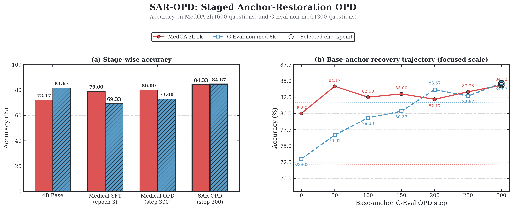
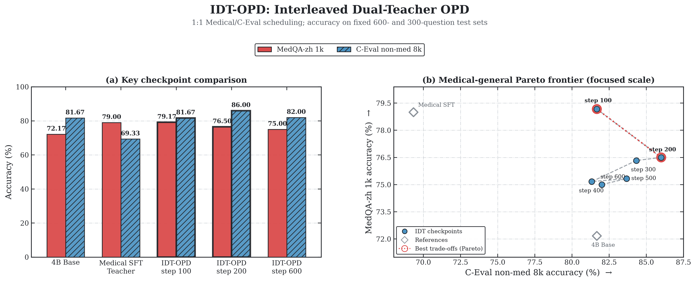
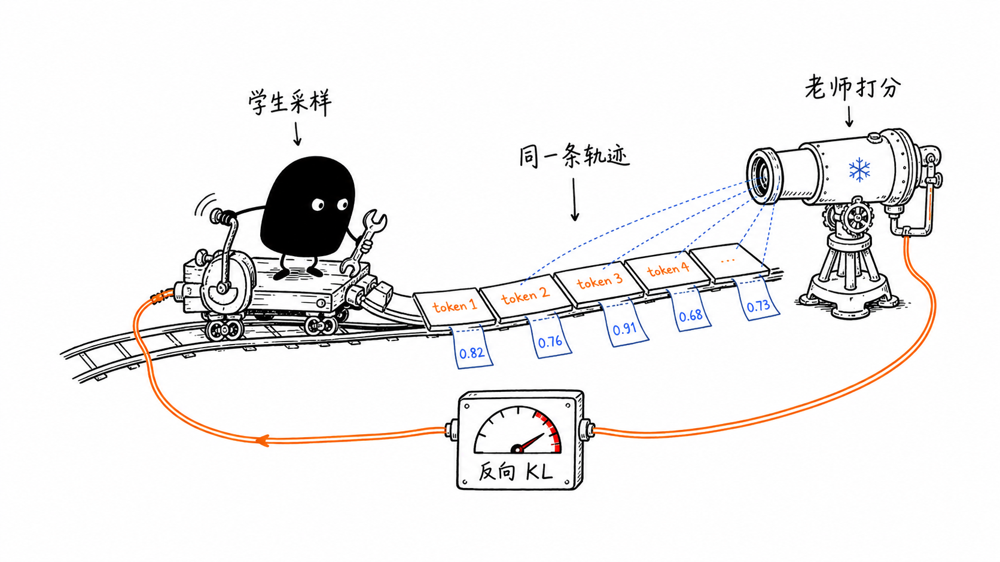
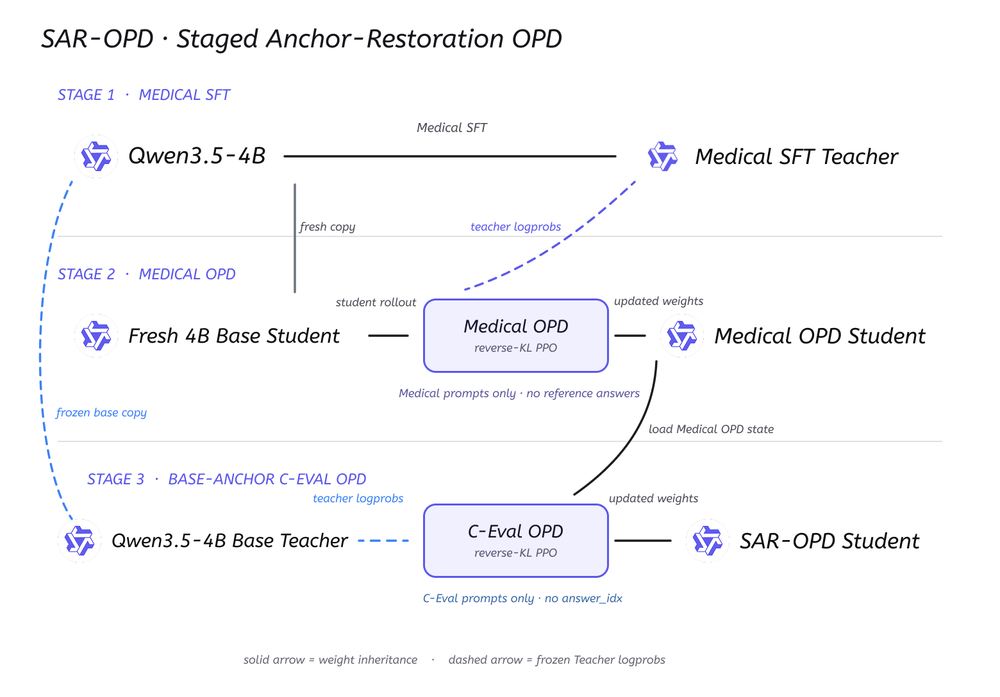
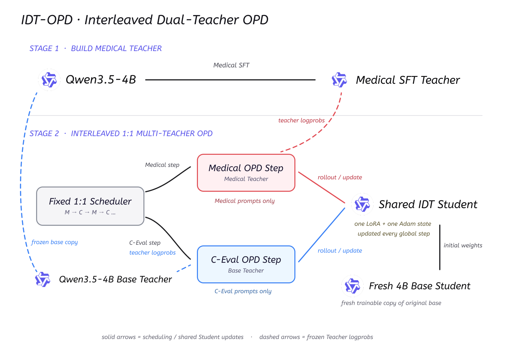

# 接下来我将复现 10 篇强化学习算法：第 2 篇，OPD 如何增强 LLM 的医疗能力，同时保住通用能力


> **代码与复现资源**
>
> - 开源仓库：[KMnO4-zx/llm-agent-rl-lab](https://github.com/KMnO4-zx/llm-agent-rl-lab)
> - PyTRIO 官网与注册入口：[https://pytrio.cn/](https://pytrio.cn/)（远程训练、采样与权重保存）
> - SwanLab 注册入口：[https://swanlab.cn/login](https://swanlab.cn/login)（训练过程与实验指标记录）
> - Medical SFT 数据集：[FreedomIntelligence/medical-o1-reasoning-SFT](https://huggingface.co/datasets/FreedomIntelligence/medical-o1-reasoning-SFT)
> - MedQA-zh 评测数据：[bigbio/med_qa](https://huggingface.co/datasets/bigbio/med_qa)
> - C-Eval 数据集：[ceval/ceval-exam](https://huggingface.co/datasets/ceval/ceval-exam)
> - 前置阅读：[通用 OPD 入门教程](https://github.com/KMnO4-zx/llm-agent-rl-lab/blob/main/03-opd/general-opd/readme.md)
> - PyTRIO Skill：[SwanHubX/pytrio-skill](https://github.com/SwanHubX/pytrio-skill)
> - SwanLab Skill：[SwanHubX/swanlab-skill](https://github.com/SwanHubX/swanlab-skill)

决定写这个系列后的第二天，其实我就已经完成了 DeepMath OPD 的代码和教程。那是一套很干净的入门实验：Student 在数学题上采样，Teacher 给同一条轨迹计算 logprobs，再通过 reverse KL 更新 Student。如果当时直接把它整理成一篇 Blog 发出来，这一篇也算是完成了。

但我觉得这样太简单了。如果只是发一篇“代码可以跑通”的 Blog 就算交差，那既有点敷衍这个系列，也有点敷衍一直在等后续的读者们。我希望每一篇除了能运行，还能留下一个真正值得讨论的问题，以及一段比较完整的实验过程。

所以我又花了一周左右，从 Medical SFT 开始设计实验，训练 Medical Teacher，尝试 Medical OPD，再一点点处理领域能力增强之后的通用能力遗忘。最后才有了这篇 Blog 里的两套方案，以及每个阶段完整的 MedQA-zh 和 C-Eval 评测结果。这一周里我从 Medical OPD 实验中获得了很多知识和反馈，也踩了不少坑。希望把这些过程写下来之后，能够帮助到同样在研究 OPD、模型蒸馏和领域能力训练的朋友。做完整个实验我大概花了 500 块钱左右吧，但这是我所有的实验操作，如果大家来复现的话大概可以在200块钱以内吧，如果只是完成 DeepMath OPD 的实验，应该只需要50 块钱吧，如果只是想要了解 OPD 的原理，简单跑几十个 step ，那应该几块钱吧？

我很喜欢 Thinking Machines Lab 的 Lilian Weng 写的 Blog。读她的 Blog，会感觉她正在坐在对面，慢慢讲清楚自己为什么研究这个问题、做过哪些尝试、看到了什么结果，又从结果里得出了什么判断。希望我在未来的某天也可以做到这一步～

为什么要用 PyTrio 做 RL 算法的复现呢？我之前也尝试过用 Verl 等一些开源的 RL 训练框架，但是我认为这些框架都太 Heavey 了。我只是想研究损失函数，但是却要付出比研究损失函数更多的时间去研究如何配置训练环境和研究开源框架的结构？我认为这是本末倒置的事情。我用过 Tinker 和 PyTrio，相比 Tinker ，PyTrio 对国人更友好，支付宝就可以充值，Tinker 需要有一张外币的信用卡，可恶！还有就是 Agentic-RL 现在要求训推一体，rollout、工具调用和长尾轨迹往往比 train 更久，自己租 8 卡时，训练侧会等 rollout，rollout 侧也会等参数更新，机器空着照样计费。但是 PyTrio 是按 Token 收费的，也就是说显卡空转的时间是不收费的，这也是我很关心的一点。

> 所以大家希望下一篇是 GSPO 还是 Search-R1 呢？

上一篇写 GRPO 的时候，训练信号来自 reward：同一道题采样多个回答，答得比组内平均水平好，就提高这条轨迹的概率；答得更差，就把概率压低。

OPD 的训练信号不一样。它不要求每个问题都有标准答案，也不需要先写一个 reward function。Student 先生成自己的回答，Teacher 再沿着 Student 真正走过的 token 轨迹逐个打分，然后把 Student 拉向 Teacher 更认可的分布。

DeepMath-103K 的版本已经整理成了一份 [通用 OPD 入门教程](https://github.com/KMnO4-zx/llm-agent-rl-lab/blob/main/03-opd/general-opd/readme.md)，把最小训练闭环完整跑通了。但只把算法跑起来还不太够，我更想知道它能不能解决一个真实一点的问题。

经好朋友推荐，这次我选择的是中文医疗能力增强。

我先用 `medical-o1-reasoning-SFT-zh` 对 `Qwen/Qwen3.5-4B` 做 Medical SFT。医疗评测确实提高了，但 C-Eval 通用能力从 `81.67%` 降到了 `69.33%`。领域能力学进去了，原本的通用能力也被明显破坏了。

所以这篇真正想研究的是：

> 能不能让一个 Medical Teacher 教 Student 医疗能力，同时让原始 Base Model 充当通用能力锚点，最后得到一个医疗能力和通用能力都比 Base 更好的模型？

我最终做了两套方案：

1. **SAR-OPD（Staged Anchor-Restoration OPD）**：先做 Medical OPD，再用 Base Teacher 分阶段恢复通用能力。
2. **IDT-OPD（Interleaved Dual-Teacher OPD）**：在同一个训练循环里，让 Medical Teacher 和 Base Teacher 按 step 交替指导同一个 Student。

先说结果：在这次实验里，SAR-OPD 的最终 checkpoint 在 MedQA-zh 上达到 `84.33%`，在 C-Eval non-med 上达到 `84.67%`，两项都超过了原始 4B Base。

> 说明一下：SAR-OPD 和 IDT-OPD 是我为了描述这两套实验方案使用的名字，并不是已有论文里的标准算法名称。本文复现的是 OPD 的核心训练机制，再在这个基础上探索医疗能力与通用能力的平衡方法。

代码都在这里：<https://github.com/KMnO4-zx/llm-agent-rl-lab>

## 先看最终结果

### 统一评测口径

为了让不同阶段能够直接比较，我固定使用两套测试集：

| 能力 | 评测集 | 样本数 | 输出预算 | 指标 |
| --- | --- | ---: | ---: | --- |
| 医疗能力 | MedQA-zh 4 options | 600 | 1024 tokens | Accuracy |
| 通用能力 | C-Eval non-med | 300 | 8192 tokens | Accuracy |

这里的 `1024` 和 `8192` 是每道题的最大输出 token 数，不是测试集样本数。后面的结果表统一写真实样本数，避免把输出预算和数据量混在一起。

### 两套方案的关键 checkpoint

| 模型 / Checkpoint | MedQA-zh（600 题） | C-Eval non-med（300 题） |
| --- | ---: | ---: |
| 4B Base | 72.17% `433/600` | 81.67% `245/300` |
| Medical SFT epoch 3 | 79.00% `474/600` | 69.33% `208/300` |
| Medical OPD step 300 | 80.00% `480/600` | 73.00% `219/300` |
| **SAR-OPD step 300** | **84.33% `506/600`** | **84.67% `254/300`** |
| IDT-OPD step 100 | 79.17% `475/600` | 81.67% `245/300` |
| IDT-OPD step 200 | 76.50% `459/600` | **86.00% `258/300`** |

先不用急着理解两套方案的训练结构，可以先看它们各自的完整结果图。

**方案一：SAR-OPD。** 重点看右侧的能力恢复轨迹：随着 Base-anchor OPD 继续训练，C-Eval 被逐步拉回，MedQA-zh 也没有掉回 Base 水平，最终两项指标都超过了原始 4B Base。



**方案二：IDT-OPD。** 重点看右侧的 Pareto frontier：step 100 更偏医疗，step 200 更偏通用；继续训练到 step 600 并没有得到更好的平衡，所以最后一步并不等于最好结果。



这张表里有三个比较有意思的现象。

第一，Medical SFT 虽然把医疗准确率从 `72.17%` 提高到 `79.00%`，但 C-Eval 同时掉了 `12.34` 个百分点。只看领域 benchmark，很容易忽略这种能力交换。

第二，SAR-OPD 最终把 MedQA-zh 提高到 `84.33%`，比 Base 高 `12.17` 个百分点；C-Eval 也达到 `84.67%`，比 Base 高 `3.00` 个百分点。这是本次实验综合结果最好的 checkpoint。

第三，IDT-OPD 没有一个“所有指标都持续上涨”的终点。step 100 更偏医疗，step 200 更偏通用，它形成的是一条能力 Tride-off 曲线。对于这种多 Teacher 训练，选 checkpoint 和早停比单纯把训练跑到最后更重要。

## OPD 到底在训练什么？

OPD，全称 On-Policy Distillation。这里的 on-policy 指的是：训练轨迹来自当前 Student，而不是固定数据，也不是 Teacher 预先生成的答案。

这条思路主要来自两条工作线：2023 年的 [Generalized Knowledge Distillation（GKD）](https://arxiv.org/abs/2306.13649) 强调让 Student 在自己生成的序列上接受 Teacher 反馈；[MiniLLM](https://arxiv.org/abs/2306.08543) 则系统研究了生成式语言模型蒸馏中的 reverse KL。本文把这两个关键点放进同一条可运行训练链路：轨迹由当前 Student 生成，Teacher 对同一条轨迹打分，再用 reverse-KL advantage 更新 Student。

一次最小的 OPD 训练循环是：

1. 从 prompt-only 数据中取一个问题。
2. 用当前 Student 采样 completion，同时保存采样时的 token logprobs。
3. 把完全相同的 `prompt + student completion` 交给 Teacher。
4. Teacher 不重新回答问题，只计算同一条 token 轨迹的 logprobs。
5. 用 Student 和 Teacher 的 logprob 差构造 reverse-KL advantage。
6. 用 PPO 或 importance sampling 更新 Student。
7. 导出最新 Student sampler，进入下一个 step。



设 Student 是 $\pi_\theta$，Teacher 是 $\pi_T$，Student 采样出的第 $t$ 个 token 是 $y_t$。代码里的 token-level reverse KL 是：

```math
r_t^{\mathrm{KL}}
=
\log \pi_\theta(y_t \mid x,y_{\lt t})
-
\log \pi_T(y_t \mid x,y_{\lt t}).
```

然后把它转成 advantage：

```math
A_t=-\beta r_t^{\mathrm{KL}}.
```

对应代码只有两行：

```python
reverse_kl = np.asarray(student_logprobs) - np.asarray(teacher_logprobs)
advantages = -args.kl_penalty_coef * reverse_kl
```

如果 Student 比 Teacher 更偏爱某个 token，`reverse_kl` 为正，advantage 为负，训练会压低这个 token 的概率；如果 Teacher 更偏爱某个 token，advantage 为正，训练会提高它的概率。

这和上一篇 GRPO 的区别很清楚：

```text
GRPO: advantage 来自同一组回答的相对 reward
OPD:  advantage 来自 Teacher 与 Student 的 token logprob 差
```

OPD 代码里也有 `group_size`，但它只是让一个 prompt 产生更多 Student 轨迹。它不会像 GRPO 一样在组内计算相对 reward，每条 completion 都独立接受 Teacher 的逐 token 监督。

如果你第一次接触 OPD，建议先看 [通用 OPD 入门教程](https://github.com/KMnO4-zx/llm-agent-rl-lab/blob/main/03-opd/general-opd/readme.md)。那篇会更详细地解释 reverse KL、自回归右移、Datum 对齐和同步/异步训练。本文重点放在两套 Medical OPD 实验为什么这样设计，以及它们最后得到了什么结果。

## 数据是怎么准备的？

这次实验一共用了三类数据：

| 数据 | 用途 | 训练时使用的字段 |
| --- | --- | --- |
| `FreedomIntelligence/medical-o1-reasoning-SFT` 中文数据 | Medical SFT、Medical OPD prompt pool | SFT 使用 `question + complex_cot + response`；OPD 只使用 `question` |
| `bigbio/med_qa` 的 MedQA-zh 4 options | 医疗能力评测 | 只用于 held-out evaluation |
| `ceval/ceval-exam` 精选 8 个 non-med subset | Base-anchor OPD、通用能力评测 | OPD 只使用题目和选项，不使用 `answer_idx` |

下载脚本会在固定 seed 下准备数据：

```bash
uv run python 03-opd/00-download-dataset.py
```

其中 C-Eval 会先按 `80% / 20%` 划分 OPD train pool 和 held-out test pool，再从 test pool 里固定抽取 300 道题。为了减少医疗领域重叠，排除了 `basic_medicine`、`clinical_medicine`、`physician`、`veterinary_medicine`、高中生物和初中生物，最后保留 8 个非医疗 subset：

```text
computer_network
college_programming
advanced_mathematics
discrete_mathematics
college_physics
logic
chinese_language_and_literature
college_economics
```

这里刻意保留了几个边界：

- MedQA-zh 的 600 道测试题不进入任何训练。
- C-Eval 的 held-out test 不进入 OPD。
- C-Eval OPD train pool 虽然包含 `answer_idx`，训练脚本会明确忽略它，只使用题目和选项作为 prompt。
- Medical OPD 不读取原数据里的 `complex_cot` 和 `response`，只读取 `question`。
- Teacher 不生成训练答案，只给 Student 实际生成的 completion 计算 logprobs。

所以这两套 OPD 都是 prompt-only distillation。真正的监督信号来自 Teacher 分布，而不是数据集答案。

## 第一步：先得到一个 Medical Teacher

两套方案共用同一个 Medical Teacher。

我先用 `02-medical-sft.py` 在中文 `medical-o1-reasoning-SFT` 上训练 `Qwen/Qwen3.5-4B`。原始数据把推理过程和最终回答分成 `complex_cot` 与 `response`，脚本会把它们整理成：

```text
<think>
{complex_cot}
</think>

{response}
```

SFT 时，system 和 user prompt 只作为上下文，不参与 loss；assistant completion 和 EOS 才有非零权重：

```python
tokens = prompt_tokens + assistant_tokens
weights = [0.0] * len(prompt_tokens) + [1.0] * len(assistant_tokens)

datum = trio.Datum(
    model_input=trio.ModelInput.from_ints(tokens[:-1]),
    loss_fn_inputs={
        "target_tokens": np.asarray(tokens[1:], dtype=np.int32),
        "weights": np.asarray(weights[1:], dtype=np.float32),
    },
)
```

我一共训练了 3 个 epoch，每个 epoch 都保存完整 Train state 和用于推理的 sampler weights。评测结果是：

| Checkpoint | MedQA-zh（600 题） | C-Eval non-med（300 题） |
| --- | ---: | ---: |
| 4B Base | 72.17% `433/600` | 81.67% `245/300` |
| Medical SFT epoch 1 | 77.67% `466/600` | 71.67% `215/300` |
| Medical SFT epoch 2 | **79.17% `475/600`** | 69.33% `208/300` |
| Medical SFT epoch 3 | 79.00% `474/600` | 69.33% `208/300` |

医疗能力确实上去了，但 C-Eval 从 `81.67%` 一路掉到 `69.33%`。为了固定后面两套 OPD 实验的 Teacher，我统一选择完成 3 个 epoch 训练后的 checkpoint。它不会作为最终模型直接部署，而是被冻结下来，专门给 fresh Student 提供医疗 token-level supervision。

这里要区分两类保存结果：

| 路径类型 | 用途 |
| --- | --- |
| `trio://.../sampler_weights/...` | 推理、评测、作为冻结 Teacher |
| `trio://.../training_states/...` | 恢复 TrainingClient，继续训练 |

Medical OPD 创建 Teacher 时需要的是 SFT `sampler_weights`；后面 SAR-OPD 的第三阶段恢复 Student 时需要的是 Medical OPD `training_state`。这两个路径不能混用。

## 方案一：SAR-OPD，分阶段锚点恢复

第一套方案的想法很直接：先让 Student 专心学习医疗能力，再用原始 Base Model 把通用能力拉回来。

我把它叫作 Staged Anchor-Restoration OPD，简称 SAR-OPD。



完整流程分成三个阶段：

```text
Stage 1: Qwen3.5-4B --Medical SFT--> Medical Teacher

Stage 2: Fresh 4B Student --Medical Teacher OPD--> Medical OPD Student

Stage 3: Medical OPD Student --4B Base Teacher OPD--> SAR-OPD Student
```

### Stage 1：Medical SFT

第一阶段就是前面已经完成的 Teacher 准备。Medical SFT epoch 3 会被冻结，不再更新，只负责对 Student 的医疗 completion 计算 logprobs。

### Stage 2：让 fresh Student 学 Medical OPD

第二阶段没有从 SFT 权重继续训练，而是重新从 `Qwen/Qwen3.5-4B` 创建一个 fresh LoRA Student：

```python
service_client = trio.ServiceClient()

training_client = await service_client.create_lora_training_client_async(
    base_model=args.base_model,
    rank=args.lora_rank,
    seed=args.seed,
)

teacher_client = await service_client.create_sampling_client_async(
    base_model=args.teacher_base_model,
    model_path=args.teacher_model_path,
)
```

这里的 `training_client` 是可训练 Student，`teacher_client` 指向 Medical SFT epoch 3 的 sampler weights。

每个 step 开始时，先从当前 Student 权重导出 sampler：

```python
student_sampler = (
    await training_client.save_weights_and_get_sampling_client_async()
)
```

然后 Student 对医疗问题采样 `group_size` 条 completion：

```python
sample_result = await student_sampler.sample_async(
    prompt=trio.ModelInput.from_ints(prompt_ids),
    num_samples=args.group_size,
    sampling_params=sampling_params,
    return_text=False,
)
```

Teacher 接收的是同一条 `prompt + completion`：

```python
all_ids = prompt_ids + completion_ids
all_logprobs = await teacher_client.compute_logprobs_async(
    trio.ModelInput.from_ints(all_ids)
)
teacher_logprobs = all_logprobs[len(prompt_ids):]
```

这里不能让 Teacher 自己重新生成一个答案。OPD 比较的是 Student 和 Teacher 在完全相同的上下文、完全相同的 token 上分别给出多大概率。如果两条 completion 不一样，就无法进行这种 token 级别的对齐。

最后构造 reverse-KL advantage，再通过 PPO 更新：

```python
reverse_kl = np.asarray(student_logprobs) - np.asarray(teacher_logprobs)
advantages = -args.kl_penalty_coef * reverse_kl

fwd_bwd_future = await training_client.forward_backward_async(
    datums,
    loss_fn="ppo",
)
optim_future = await training_client.optim_step_async(adam)

fwd_bwd_result = await fwd_bwd_future
await optim_future
```

这次 Medical OPD 的正式配置是：

```text
Student: Qwen/Qwen3.5-4B fresh LoRA
Teacher: Medical SFT epoch 3
Steps: 300
Batch size: 4 prompts
Group size: 4 completions per prompt
Max completion tokens: 2048
Learning rate: 4e-5
Loss: PPO
Sampler refresh: every step
```

300 step 后，医疗能力从 Base 的 `72.17%` 提高到 `80.00%`，但 C-Eval 只有 `73.00%`。相比 Medical SFT 的 `69.33%` 已经好一些，但通用能力仍然没有回到 Base 水平。

所以我继续做第三阶段。

### Stage 3：用 Base Teacher 恢复通用能力

第三阶段把 Medical OPD step 300 的完整 Train state 恢复成新的 TrainingClient：

```python
training_client = await service_client.create_training_client_from_state_async(
    path=args.student_state_path
)
```

然后把原始 `Qwen/Qwen3.5-4B` 作为冻结 Teacher：

```python
teacher_client = await service_client.create_sampling_client_async(
    base_model="Qwen/Qwen3.5-4B"
)
```

训练 prompt 换成 C-Eval non-med 的题目和选项，但不读取 `answer_idx`。Student 仍然先自己作答，Base Teacher 再给 Student 的实际 completion 计算 logprobs。

这里的目标不是让 Student 背 C-Eval 答案，而是让它重新靠近原始 Base 在通用问题上的 token 分布。我把 Base Model 当成一个 anchor，所以这一阶段叫 Base-anchor C-Eval OPD。

第三阶段的配置比 Medical OPD 更保守：

```text
Student initialization: Medical OPD step 300 Train state
Teacher: original Qwen/Qwen3.5-4B
Steps: 300
Batch size: 4 prompts
Group size: 4 completions per prompt
Max completion tokens: 2048
Learning rate: 5e-6
Loss: PPO
Checkpoint: every 50 steps
```

学习率从 `4e-5` 降到 `5e-6`，是因为这一阶段更像能力恢复和细调，我不希望一次更新把刚学到的医疗能力冲掉。

### SAR-OPD 的结果


完整结果如下：

| 阶段 / Checkpoint | MedQA-zh（600 题） | C-Eval non-med（300 题） |
| --- | ---: | ---: |
| 4B Base | 72.17% `433/600` | 81.67% `245/300` |
| Medical SFT epoch 1 | 77.67% `466/600` | 71.67% `215/300` |
| Medical SFT epoch 2 | 79.17% `475/600` | 69.33% `208/300` |
| Medical SFT epoch 3（Medical Teacher） | 79.00% `474/600` | 69.33% `208/300` |
| Medical OPD step 300（第三阶段 step 0） | 80.00% `480/600` | 73.00% `219/300` |
| Base-anchor OPD step 50 | 84.17% `505/600` | 76.67% `230/300` |
| Base-anchor OPD step 100 | 82.50% `495/600` | 79.33% `238/300` |
| Base-anchor OPD step 150 | 83.00% `498/600` | 80.33% `241/300` |
| Base-anchor OPD step 200 | 82.17% `493/600` | 83.67% `251/300` |
| Base-anchor OPD step 250 | 83.33% `500/600` | 82.67% `248/300` |
| **Base-anchor OPD step 300** | **84.33% `506/600`** | **84.67% `254/300`** |

C-Eval 的恢复趋势比较清楚：从 Medical OPD 的 `73.00%` 逐步提高到 `84.67%`。中间会有波动，但整体重新越过了 Base 的 `81.67%`。

更意外的是 MedQA-zh。Base-anchor 阶段没有使用医疗问题，Teacher 也是原始 Base，但医疗准确率没有掉回去，反而从 `80.00%` 提高到 `84.33%`。这说明在这次实验里，恢复通用分布和保持医疗能力并不一定是零和关系。

不过这里只能把它当作这次训练结果，不能直接推断成普遍规律。学习率、prompt、生成预算、checkpoint 方差都可能影响最终数值。后面还需要多随机种子和消融实验，才能判断这部分提升具体来自哪里。

最终我选择的 SAR-OPD checkpoint 是：

```text
trio://run_1vbwh91n5le5/sampler_weights/opd-ceval-async-qwen35-4b-base-anchor-ppo-steps300-step000300
```

相对原始 4B Base：

```text
MedQA-zh:       72.17% -> 84.33%  (+12.17 percentage points)
C-Eval non-med: 81.67% -> 84.67%  (+3.00 percentage points)
```

## 方案二：IDT-OPD，交替双教师训练

SAR-OPD 的效果很好，但它的工程流程比较长：

```text
训练 SFT Teacher
    ↓
训练 Medical OPD Student
    ↓
保存并恢复 Train state
    ↓
继续做 Base-anchor OPD
```

于是我想试另一种设计：能不能让同一个 fresh Student 在一条训练循环里同时接受两个 Teacher 的监督？

我把这个方案叫作 Interleaved Dual-Teacher OPD，简称 IDT-OPD。



它仍然使用前面训练好的 Medical SFT Teacher，但 Student 重新从 fresh `Qwen/Qwen3.5-4B` 初始化。训练时采用固定 `1:1` 调度：

```text
Medical -> C-Eval -> Medical -> C-Eval -> ...
```

Medical step 使用 Medical SFT epoch 3 作为 Teacher；C-Eval step 使用原始 4B Base 作为 Teacher。两种 step 共用：

- 同一个 LoRA Student；
- 同一个 TrainingClient；
- 同一份 Adam optimizer state；
- 同一个全局 step；
- 每一步更新后的最新 Student 权重。

### 固定 1:1 调度怎么写？

代码先根据参数构造一个周期：

```python
def build_task_schedule(args):
    return (
        ("medical",) * args.medical_steps_per_cycle
        + ("ceval",) * args.ceval_steps_per_cycle
    )
```

当两个参数都是 1 时，schedule 就是：

```python
("medical", "ceval")
```

训练循环根据全局 step 选择当前任务、数据和 Teacher：

```python
task = schedule[step % len(schedule)]

if task == "medical":
    rows = medical_rows
    teacher_client = medical_teacher
    system_message = args.medical_system_message
else:
    rows = ceval_rows
    teacher_client = base_teacher
    system_message = args.ceval_system_message
```

后面的 Student sampling、Teacher logprobs、reverse KL、PPO update 都是同一套逻辑。区别只有当前 step 使用什么 prompt，以及由哪个 Teacher 打分。

我还给两种任务分别维护自己的 task step：

```python
task_steps = {"medical": 0, "ceval": 0}

batch = batch_for_task_step(
    rows=rows,
    task_step=task_steps[task],
    batch_size=args.batch_size,
)

task_steps[task] += 1
```

这样 Medical 与 C-Eval 会各自按自己的进度取 batch，不会因为全局 step 交替而跳过一半数据。

### IDT-OPD 的正式配置

```text
Student: Qwen/Qwen3.5-4B fresh LoRA
Medical Teacher: Medical SFT epoch 3
C-Eval Teacher: original Qwen/Qwen3.5-4B
Schedule: Medical 1 step + C-Eval 1 step
Global steps: 600 = M300 + C300
Batch size: 4 prompts
Group size: 4 completions per prompt
Max completion tokens: 2048
Learning rate: 1e-5
Loss: PPO
Sampler refresh: every global step
```

每 100 个全局 step，Medical 和 C-Eval 实际各完成 50 个 optimizer step。所以 step 200 对应 `M100 + C100`，不是两种任务各训练了 200 step。

### IDT-OPD 的结果


| Checkpoint | 任务进度 | MedQA-zh（600 题） | C-Eval non-med（300 题） |
| --- | --- | ---: | ---: |
| 4B Base | - | 72.17% `433/600` | 81.67% `245/300` |
| Medical SFT Teacher | - | 79.00% `474/600` | 69.33% `208/300` |
| **IDT-OPD step 100** | `M50 + C50` | **79.17% `475/600`** | 81.67% `245/300` |
| **IDT-OPD step 200** | `M100 + C100` | 76.50% `459/600` | **86.00% `258/300`** |
| IDT-OPD step 300 | `M150 + C150` | 76.33% `458/600` | 84.33% `253/300` |
| IDT-OPD step 400 | `M200 + C200` | 75.17% `451/600` | 81.33% `244/300` |
| IDT-OPD step 500 | `M250 + C250` | 75.33% `452/600` | 83.67% `251/300` |
| IDT-OPD step 600 | `M300 + C300` | 75.00% `450/600` | 82.00% `246/300` |

step 100 是一个更偏医疗的 checkpoint：MedQA-zh 达到 `79.17%`，C-Eval 正好保持 Base 的 `81.67%`。

step 200 则更偏通用：MedQA-zh 为 `76.50%`，C-Eval 达到整个 IDT 实验最高的 `86.00%`。相对 Base，两项指标都提高了 `4.33` 个百分点，是一个更均衡的 checkpoint。

继续训练到 step 600 并没有继续提高。医疗准确率逐渐下降到 `75.00%`，C-Eval 也回落到 `82.00%`。这说明固定 1:1 调度并不会自动收敛到一个越来越好的平衡点，Teacher 之间的拉扯、学习率、任务顺序和训练时长都会影响轨迹。

所以 IDT-OPD 最重要的结果不是“最后一步是多少”，而是 step 100 和 step 200 形成了两个 Pareto 有效 checkpoint：

```text
step 100: 更偏医疗，同时把 C-Eval 保持在 Base 水平
step 200: 医疗仍高于 Base，C-Eval 达到最高
```

如果优先选择综合更均衡的结果，我会选 step 200：

## 两套方案应该怎么选？

| 对比项 | SAR-OPD | IDT-OPD |
| --- | --- | --- |
| 训练结构 | 分阶段顺序训练 | 双 Teacher 按 step 交替训练 |
| Student 初始化 | Medical OPD 从 fresh Base 开始；第三阶段从 Medical OPD state 恢复 | fresh Base Student，一条训练循环到底 |
| Teacher 使用方式 | 先 Medical Teacher，再 Base Teacher | Medical Teacher 与 Base Teacher 交替 |
| 当前最佳 MedQA-zh | **84.33%** | 79.17% |
| 当前最佳 C-Eval | 84.67% | **86.00%** |
| 主要优点 | 当前综合效果最好，能力恢复过程清楚 | 结构统一，容易扩展任务比例和更多 Teacher |
| 主要难点 | 流程更长，需要正确保存和恢复 Train state | 对 schedule、学习率、早停和 checkpoint 选择敏感 |
| 更适合的场景 | 追求这次实验里的最终综合性能 | 多领域、多 Teacher、持续训练和 Pareto 探索 |

如果只根据这轮实验选最终模型，我会选择 SAR-OPD step 300。它的 MedQA-zh 和 C-Eval 都超过 Base，也是两套方案里综合表现最好的 checkpoint。

IDT-OPD 的意义更多在结构上。今天可以是一个 Medical Teacher 和一个 Base Teacher，后面也可以扩展成代码、数学、Agent tool-use 等多个 Teacher，再通过调度比例决定训练时更关注哪种能力。

当然，Teacher 数量增加以后，问题也会更复杂：不同 Teacher 的 tokenizer 必须兼容，任务 prompt 要对齐，调度比例要调，optimizer state 还会把不同任务的更新历史混在一起。IDT-OPD 更灵活，但不代表它天然比顺序训练稳定。

## 如何运行这套实验？

如果直接 clone 仓库，先安装依赖并登录 PyTRIO：

```bash
git clone https://github.com/KMnO4-zx/llm-agent-rl-lab.git
cd llm-agent-rl-lab

uv sync
trio login
```

训练脚本通过 PyTRIO SDK 运行；两个评测脚本使用 TRIO 的 OpenAI-compatible API，需要在 `03-opd/.env` 中配置同一个 API key：

```bash
cp 03-opd/.env.example 03-opd/.env
```

然后把 `.env` 里的占位符替换掉：

```text
PYTRIO_API_KEY="your_pytrio_api_key_here"
```

### 1. 下载并整理数据

正式下载：

```bash
uv run python 03-opd/00-download-dataset.py
```

如果只想先检查数据链路：

```bash
uv run python 03-opd/00-download-dataset.py \
  --medical-sft-sample-size 100 \
  --medqa-sample-size 20 \
  --ceval-train-size 100 \
  --ceval-test-size 20
```

### 2. 训练 Medical SFT Teacher

小成本试跑：

```bash
uv run python 03-opd/02-medical-sft.py \
  --sample-size 100 \
  --num-epochs 1 \
  --batch-size 2 \
  --max-length 2048 \
  --swanlab-mode disabled
```

正式训练：

```bash
uv run python 03-opd/02-medical-sft.py \
  --num-epochs 3 \
  --batch-size 16 \
  --max-length 2048 \
  --swanlab-mode online
```

训练完成后记录 epoch 3 的 `sampler_weights` 路径，后面两套方案都会把它作为 Medical Teacher。

### 3. 运行 Medical OPD

```bash
uv run python 03-opd/03-medical-opd-async.py \
  --teacher-model-path YOUR_SFT_SAMPLER_WEIGHTS_PATH \
  --steps 300 \
  --batch-size 4 \
  --group-size 4 \
  --sample-size 0 \
  --max-tokens 2048 \
  --learning-rate 4e-5 \
  --save-every-steps 300 \
  --swanlab-mode online
```

训练结束后会同时得到：

```text
Medical OPD Train state      -> 用于 SAR-OPD 第三阶段继续训练
Medical OPD sampler weights  -> 用于评测或推理
```

### 4. 运行 SAR-OPD 的 Base-anchor 阶段

```bash
uv run python 03-opd/04-ceval-opd-async.py \
  --student-state-path YOUR_MEDICAL_OPD_TRAIN_STATE_PATH \
  --steps 300 \
  --batch-size 4 \
  --group-size 4 \
  --sample-size 0 \
  --max-tokens 2048 \
  --learning-rate 5e-6 \
  --save-every-steps 50 \
  --swanlab-mode online
```

`--student-state-path` 必须传 `save_state` 生成的 Train state，不能传 `/sampler_weights/` 路径。脚本会在任何 C-Eval OPD update 之前先保存一份 source-copy state，并为正式 run 保存 step 0 的 state 和 sampler weights，方便之后精确比较恢复轨迹。

### 5. 运行 IDT-OPD

```bash
uv run python 03-opd/05-interleaved-multi-teacher-opd.py \
  --medical-teacher-model-path YOUR_SFT_SAMPLER_WEIGHTS_PATH \
  --steps 600 \
  --medical-steps-per-cycle 1 \
  --ceval-steps-per-cycle 1 \
  --batch-size 4 \
  --group-size 4 \
  --max-tokens 2048 \
  --learning-rate 1e-5 \
  --save-every-steps 50 \
  --swanlab-mode online
```

如果想试 `2:1` 医疗偏置调度，只需要改成：

```bash
--medical-steps-per-cycle 2 \
--ceval-steps-per-cycle 1
```

checkpoint 最好保存在完整调度周期结束后。`1:1` 的周期长度是 2，所以保存间隔应该是 2 的倍数；`2:1` 的周期长度是 3，保存间隔应该是 3 的倍数。

### 6. 评测 sampler weights

MedQA-zh：

```bash
uv run python 03-opd/01-eval-medical.py \
  --model YOUR_SAMPLER_WEIGHTS_PATH \
  --max-tokens 1024 \
  --concurrency 16
```

C-Eval non-med：

```bash
uv run python 03-opd/01-eval-ceval.py \
  --model YOUR_SAMPLER_WEIGHTS_PATH \
  --max-tokens 8192 \
  --concurrency 16
```

评测结果会写入 `03-opd/eval-results/`，每次会保存逐题 JSONL 和汇总 metrics JSON。比较 checkpoint 时要保持数据文件、system prompt、temperature 和输出预算一致，否则准确率没有直接可比性。

## 训练时应该看哪些指标？

两套 OPD 脚本都会把训练过程记录到 SwanLab。重点指标包括：

| 指标 | 含义 |
| --- | --- |
| `opd/reverse_kl_mean` | Student 与 Teacher 在采样 token 上的平均 logprob 差 |
| `opd/reverse_kl_std` | token-level reverse KL 的离散程度 |
| `data/datums` | 当前 step 实际进入训练的 completion 数 |
| `data/completion_tokens_mean` | 每条 completion 的平均 token 数 |
| `data/completion_tokens_total` | 当前 step 的 completion token 总数 |
| `step/completion_tokens_per_second` | 整个 OPD step 的 token 吞吐 |
| `trainer/*` | PyTRIO 返回的 PPO loss 等训练指标 |

IDT-OPD 会把 Medical 与 C-Eval 的指标分别记录到 `medical/*` 和 `ceval/*` 下，同时额外记录：

```text
train/medical_steps
train/ceval_steps
train/medical_ratio
train/ceval_ratio
```

这里的 tokens/s 是整步 OPD 吞吐，包含 Student sampling、Teacher logprobs、forward/backward、optimizer step 和 sampler refresh，不等同于纯推理服务的生成速度。

另外，reverse KL 下降只表示 Student 更接近当前 Teacher，不代表 benchmark 一定提高。尤其 IDT-OPD 有两个目标不同的 Teacher，单独看 loss 或 KL 很难判断最终能力平衡，还是要定期保存 checkpoint，并用独立评测集验证。

## 这次实验还有哪些边界？

这篇已经把两套流程完整跑通并做了固定评测，但它还不是一个完整的论文级消融实验。

第一，目前每套方案只有一条主要训练轨迹，没有多随机种子均值和方差。像 `84.33%` 这种结果可能包含 checkpoint 波动，不能把小幅差异都理解成稳定提升。

第二，SAR-OPD 和 IDT-OPD 使用的学习率不同：Medical OPD 是 `4e-5`，Base-anchor 阶段是 `5e-6`，IDT-OPD 是 `1e-5`。因此两套方案的结果差异不能全部归因于“顺序训练”或“交替训练”。

第三，还没有系统消融 `group_size`、`kl_penalty_coef`、PPO 与 importance sampling、sampler refresh 间隔，以及 Medical/C-Eval 的调度比例。IDT-OPD 的 `1:1` 只是这次已经跑完的一条配置，不代表最优比例。

第四，MedQA-zh 和 C-Eval 都是选择题 benchmark。它们适合观察模型能力变化，但不能代表真实临床问答安全性，也不能把这些准确率直接解释成可以用于医疗诊断。

最后，这篇复现的是 OPD 的训练闭环，并基于它做了两个应用方案。它不是对 GKD、MiniLLM 或其他 OPD 论文全部数据、模型和 benchmark 的严格复刻。本文能够确认的是：在这套本地代码、训练配置和固定评测下，两种多能力 OPD 训练路径都跑通了，并产生了可复核的 checkpoint 结果。

## 小结

这次实验最开始只是想给 4B 模型增加一点中文医疗能力，最后真正遇到的问题却是领域增强和通用能力遗忘之间的平衡。

Medical SFT 很快把医疗知识教给了模型，但也让 C-Eval 从 `81.67%` 掉到 `69.33%`。OPD 给了我另一种训练方式：Student 不再背固定答案，而是先暴露自己当前会生成什么，再由不同 Teacher 沿着这些真实轨迹提供 token-level supervision。

SAR-OPD 把训练拆成两个清楚的目标：先学医疗，再用 Base anchor 恢复通用能力。它在当前实验里得到最好的综合结果：

```text
MedQA-zh:       84.33%
C-Eval non-med: 84.67%
```

IDT-OPD 则把两个 Teacher 放进同一个训练循环。它没有产生一个单调变好的最终点，但给出了两个不同取向的 Pareto checkpoint，也说明多 Teacher OPD 可以被做成一种更通用的能力调度结构。

我觉得 OPD 最有意思的地方，也正在这里。它不只是一种“大模型压缩到小模型”的蒸馏方法。只要 Teacher 和 Student 能在同一条 token 轨迹上对齐 logprobs，我们就可以让不同 Teacher 分别代表不同能力，再决定 Student 应该在什么时候、在哪类 prompt 上向谁学习。

## 参考资料

### 方法与模型

1. Rishabh Agarwal et al. [On-Policy Distillation of Language Models: Learning from Self-Generated Mistakes](https://arxiv.org/abs/2306.13649), 2023.
2. Yuxian Gu, Li Dong, Furu Wei, Minlie Huang. [MiniLLM: Knowledge Distillation of Large Language Models](https://arxiv.org/abs/2306.08543), 2023.
3. Junying Chen et al. [HuatuoGPT-o1, Towards Medical Complex Reasoning with LLMs](https://arxiv.org/abs/2412.18925), 2024.

### 数据集与评测基准

1. Di Jin et al. [What Disease does this Patient Have? A Large-scale Open Domain Question Answering Dataset from Medical Exams](https://arxiv.org/abs/2009.13081), 2020.
2. Yuzhen Huang et al. [C-Eval: A Multi-Level Multi-Discipline Chinese Evaluation Suite for Foundation Models](https://arxiv.org/abs/2305.08322), 2023.
3. Medical SFT 数据集：[FreedomIntelligence/medical-o1-reasoning-SFT](https://huggingface.co/datasets/FreedomIntelligence/medical-o1-reasoning-SFT)
4. MedQA 评测数据：[bigbio/med_qa](https://huggingface.co/datasets/bigbio/med_qa)
5. C-Eval 评测数据：[ceval/ceval-exam](https://huggingface.co/datasets/ceval/ceval-exam)

### 实现与实验工具

1. 本文完整代码：[KMnO4-zx/llm-agent-rl-lab](https://github.com/KMnO4-zx/llm-agent-rl-lab/tree/main/03-opd)
2. PyTRIO 文档：[快速开始](https://docs.pytrio.cn/docs) · [Compute Logprobs](https://docs.pytrio.cn/docs/advanced/compute_logprobs) · [自定义 Loss Function](https://docs.pytrio.cn/docs/guide/loss_fn)
3. SwanLab 文档：[快速开始](https://docs.swanlab.cn/guide_cloud/general/quick-start.html)
