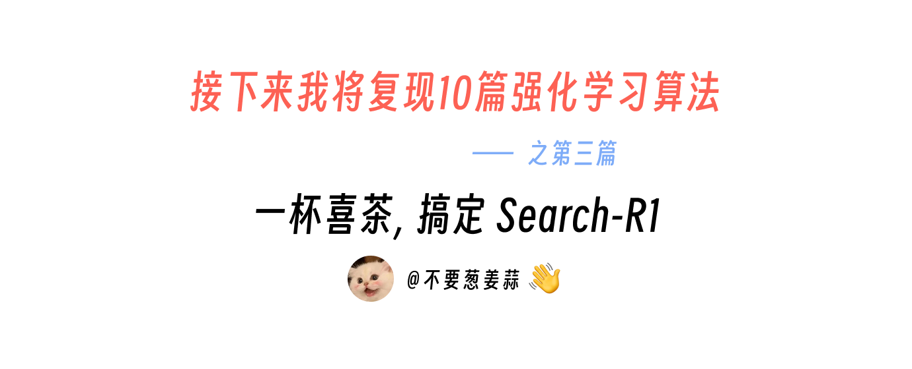
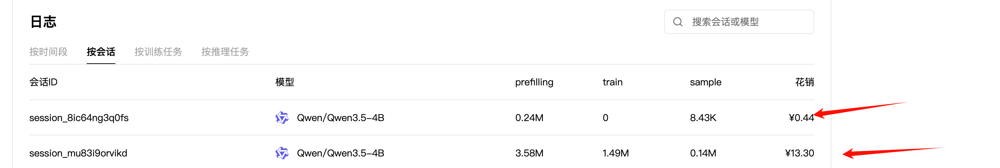
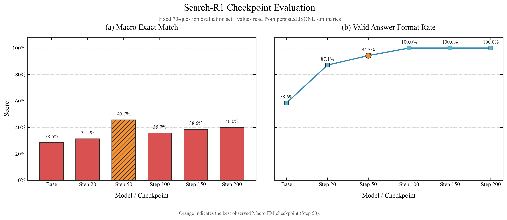
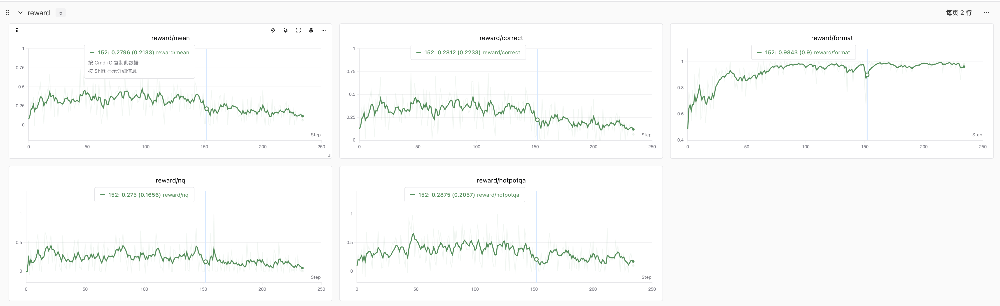
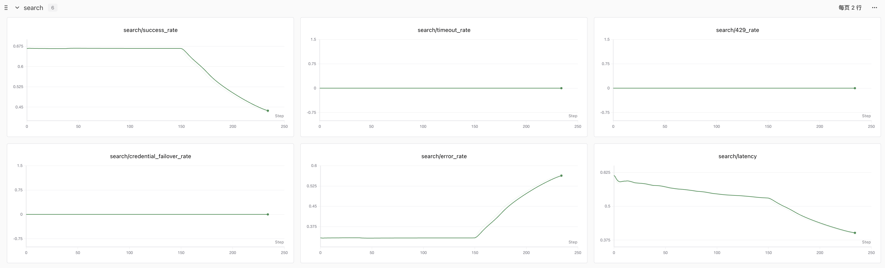
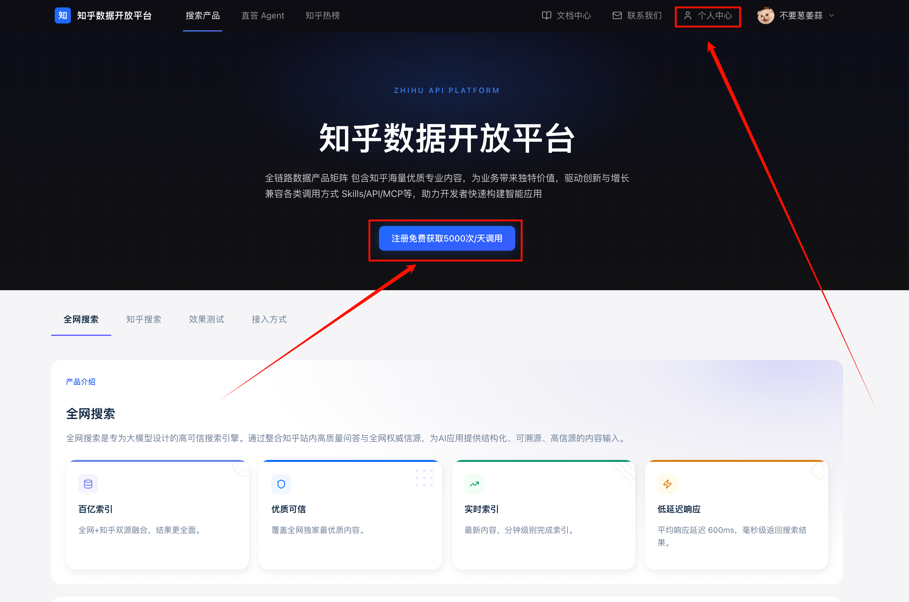

# 接下来我将复现 10 篇强化学习算法：第 3 篇，一杯喜茶，搞定 Search-R1



<div align="center">
  <a href="https://www.zhihu.com/people/feng-qi-xia-pian" target="_blank"></a>
  <a href="https://www.xiaohongshu.com/user/profile/63c2055e000000002502c58c" target="_blank"></a>
  <a href="https://github.com/KMnO4-zx/llm-agent-rl-lab"></a>
</div>

> **代码与复现资源**
>
> - 本文完整代码：[KMnO4-zx/llm-agent-rl-lab/03-search-r1](https://github.com/KMnO4-zx/llm-agent-rl-lab/tree/main/03-search-r1)
> - Search-R1 论文：[Search-R1: Training LLMs to Reason and Leverage Search Engines with Reinforcement Learning](https://arxiv.org/abs/2503.09516)
> - Search-R1 官方实现：[PeterGriffinJin/Search-R1](https://github.com/PeterGriffinJin/Search-R1)
> - 知乎搜索 API Key 申请：[知乎数据开放平台](https://developer.zhihu.com/)
> - PyTRIO 官网：[https://pytrio.cn/](https://pytrio.cn/)
> - SwanLab 实验记录：[https://swanlab.cn/@kmno4/llm-agent-rl-lab-search-r1/runs/iy76hn51/chart](https://swanlab.cn/@kmno4/llm-agent-rl-lab-search-r1/runs/iy76hn51/chart)
> - PyTRIO Skill：[SwanHubX/pytrio-skill](https://github.com/SwanHubX/pytrio-skill)

这是“接下来我将复现 10 篇强化学习算法”系列的第三篇。

前面三篇分别讲了：

- [第 0 篇：强化学习基础——损失函数](https://github.com/KMnO4-zx/llm-agent-rl-lab/blob/main/00-loss-function/readme.md)
- [第 1 篇：GRPO](https://github.com/KMnO4-zx/llm-agent-rl-lab/blob/main/01-grpo/readme.md)
- [第 2 篇：OPD](https://github.com/KMnO4-zx/llm-agent-rl-lab/blob/main/02-opd/readme.md)

这一次终于轮到我一直很想做的 Agentic RL：让模型在回答问题的过程中，自己决定什么时候搜索、搜索什么、看到搜索结果后要不要继续搜，最后再给出答案。

先说最让我开心的一件事：这个实验很便宜，少喝一杯奶茶就行了。

我这次截图里的完整训练会话（第一个是 Evaluation，第二个是 Training），PyTRIO 一共花了 `13.30` 元。北京一杯喜茶大概 `17.5～20.5` 元，所以标题并没有夸张，我确实用不到一杯喜茶的钱，完成了一次真正的 Search-R1 训练。



<p align="center">
  
</p>

更重要的是，学习者不需要把训练跑到 100 或 200 step 才能知道代码有没有效果。

> 在搜索环境稳定的前提下，运行 **20 个 step**，就已经能够看到模型的 Format Rate 和回答行为发生变化。

这是我们的 checkpoint 评测结果。后面还会再次展开这张图，现在可以先看 Step 20 和 Step 50：



在这次固定 70 题的评测里：

```text
Base Model:  Macro EM 28.57% · Format 58.57%
RL Step 20:  Macro EM 31.43% · Format 87.14%
RL Step 50:  Macro EM 45.71% · Format 94.29%
```

这篇 Blog 想做的事情很简单：不要求你准备一台 8 卡机器，不要求你先研究几个月 veRL，也不要求你下载一个解压后 160 GB 的检索数据库。我们只保留 Search-R1 最重要的算法结构，用 Qwen3.5-4B、PyTRIO 和一个免费的在线搜索 API（感谢知乎），把完整训练闭环跑起来。

## Search-R1 是从哪里来的？

Search-R1 是 Bowen Jin 等人在 2025 年提出的一项工作，全名是：

> Search-R1: Training LLMs to Reason and Leverage Search Engines with Reinforcement Learning

它想解决的问题很现实。

传统 RAG 通常是在模型回答前先检索一次：

```text
问题 → 检索 → 把结果塞进 prompt → 模型回答
```

这对于简单事实题很好用，但多跳问题经常不是搜一次就结束。比如：

```text
《小王子》的作者出生在哪个国家？
```

模型可能要先搜索：

```text
The Little Prince author
```

得到作者是 Antoine de Saint-Exupéry，再搜索：

```text
Antoine de Saint-Exupéry birthplace country
```

最后才能回答 France。

真正困难的不是“搜索引擎能不能搜到”，而是模型要学会一连串决策：

- 当前信息够不够？
- 下一条 query 应该写什么？
- 搜索结果里哪个实体才是下一跳？
- 需要继续搜索，还是应该停止并回答？

如果这些决策只写在 prompt 里，模型是在推理时临时照着说明书操作。Search-R1 更进一步：它让模型通过强化学习，真正把“推理与搜索交替进行”学进参数里。

论文里最核心的变化可以概括成一句话：

> 不再把搜索当成回答前的固定步骤，而是把它变成模型在整条推理轨迹中可以反复选择的动作。

## 用人话解释 Search-R1

可以把模型想象成一个参加开卷考试的学生。

普通 RAG 是老师先帮他查好一页资料，再让他作答。

Search-R1 则是把搜索框交给学生：他可以先想一会儿，输入一条 query，阅读结果；如果信息仍然不够，就换一个 query 再查；等他认为证据足够了，再写最终答案。

考试结束后，我们只检查最终答案：

- 答对了，reward 高；
- 答错了，reward 低；
- 连规定的答案格式都没有写出来，再扣一点分。

然后把同一道题的多条轨迹放在一起比较。比组内平均水平好的轨迹被鼓励，比平均水平差的轨迹被压低。

整个过程如下：


这里有一个很容易误解的点：

> Search-R1 不是在训练搜索引擎，也不是在训练一个新的 embedding 模型。搜索环境保持固定，真正被更新的是大模型的 LoRA 权重。

模型学习的是：什么时候调用工具、怎样构造 query、如何使用返回的证据，以及什么时候停止搜索并回答。

## 我们是怎么复现的？

原版 Search-R1 建立在 veRL 上，官方 Quick Start 默认下载 Wikipedia corpus 和 E5 索引，再单独启动一个本地 retriever server。

我最开始也想照着原版做。但把数据库下载并解压后，体积大约 160 GB；如果希望检索服务在训练期间流畅运行，服务器还需要大约 180 GB 内存。对于严谨复刻论文环境来说，这些资源当然有意义，但对于第一次学习 Search-R1 的人，它们反而会把注意力从算法本身移开。

很多人最后不是卡在 reward、advantage 或 loss mask，而是卡在：

```text
索引怎么下载？
为什么解压后磁盘不够？
Faiss 为什么启动失败？
retriever server 为什么 OOM？
训练卡和检索卡应该怎么分？
```

这些问题都是真实的工程问题，但它们并不会帮助我们更快理解 Search-R1 的核心算法。

所以我做了一个替换：

```text
原论文：本地 Wikipedia corpus + E5 retriever
本文：  知乎全局搜索 API
```

Search-R1 官方代码本身也支持把本地检索器替换成在线搜索引擎，因为算法只要求存在这样一个接口：

```text
search(query) → observations
```

只要模型仍然需要自己生成 query、读取 observation、继续推理并获得最终 reward，Search-R1 的核心训练闭环就没有改变。

我们的实现配置如下：

| 项目 | 本文实现 |
| --- | --- |
| Base Model | `Qwen/Qwen3.5-4B` |
| 训练参数 | LoRA rank 32 |
| 训练框架 | PyTRIO |
| 搜索环境 | 知乎全局搜索 API，Top 3 |
| 训练数据 | NQ + HotpotQA |
| 每个 step | 8 道问题 |
| 每道问题 | 8 条轨迹 |
| 最大搜索次数 | 4 |
| 最大 assistant turns | 6 |
| 最大轨迹长度 | 8,192 tokens |
| Reward | Exact Match + Format |
| Advantage | `reward - group_mean` |
| Loss | `importance_sampling` |

这不是对原论文基础设施和最终分数的逐项复刻，而是一次**核心算法复现**：保留问题、工具、环境交互、group-relative advantage、retrieved-token mask 和 policy update，把最重的本地检索基础设施换成更容易获得的在线搜索服务。

我认为这对于学习算法更有价值。你可以先用极小的成本理解 Search-R1，等真正需要追求论文指标时，再把 `search(query)` 换回本地 Wikipedia retriever。

## 为什么我觉得 PyTRIO 很适合 Agentic RL？

我以前也尝试过用 veRL 等框架做强化学习。它们当然很强，但如果我只是想研究一个算法，往往要先处理训推一体、模型权重同步、vLLM、分布式训练和多卡资源调度。

Agentic RL 又比普通数学 RL 更麻烦。一次 rollout 里面不只有模型生成：

```text
模型生成 → 工具调用 → 等待环境 → 模型继续生成 → 再调用工具 → ……
```

如果自己租一台 8 卡机器，模型等待搜索 API 时 GPU 可能空着；训练侧等待长尾 rollout 时 GPU 也可能空着，但机器仍然按整段时间计费。

PyTRIO 把这个分工拆得很舒服：

- 本地 Python：数据、工具环境、rollout 状态机、reward、advantage、实验循环；
- PyTRIO：模型采样、前向、反向、LoRA optimizer、checkpoint 和 sampler weights。

本地代码只需要像普通 Python 一样调用：

```python
sampling_client = training_client.save_weights_and_get_sampling_client()

training_client.forward_backward(
    datums,
    loss_fn="importance_sampling",
).result()

training_client.optim_step(adam_params).result()
```

完整训练循环在 [`train.py`](https://github.com/KMnO4-zx/llm-agent-rl-lab/blob/main/03-search-r1/train.py)。

我不需要持有一台 8 卡机器，也不需要把 rollout 和 trainer 塞进同一个集群。对这类“生成很慢、工具调用很多、真正 backward 时间反而不长”的任务，按实际 token 使用远端训练服务会自然很多。

这也是我觉得 PyTRIO 很像一种属于未来的模型训练基础设施的原因：研究者写的是算法和实验，底层训练服务更像随用随取的算力 API。

## 先看实验结果

我们使用固定的 70 道题做开发评测：7 个 benchmark，每个 benchmark 固定抽取 10 道题。


完整结果如下：

| 模型 / Checkpoint | Macro EM | Format | 2Wiki | Bamboogle | HotpotQA | MuSiQue | NQ | PopQA | TriviaQA |
| --- | ---: | ---: | ---: | ---: | ---: | ---: | ---: | ---: | ---: |
| Qwen3.5-4B | 28.57% | 58.57% | 30% | 70% | 30% | 10% | 20% | 20% | 20% |
| RL Step 20 | 31.43% | 87.14% | 30% | 50% | 40% | 10% | 20% | 10% | 60% |
| **RL Step 50** | **45.71%** | **94.29%** | **60%** | **70%** | **50%** | **30%** | **30%** | 20% | **60%** |
| RL Step 100 | 35.71% | 100% | 40% | 70% | 30% | 0% | 20% | 30% | 60% |
| RL Step 150 | 38.57% | 100% | 40% | 70% | 30% | 20% | 20% | 30% | 60% |
| RL Step 200 | 40.00% | 100% | 40% | 70% | 40% | 10% | 30% | 30% | 60% |

### 20 step 已经能够看到效果

如果你的目标是理解和验证算法，不需要一上来就跑 200 step。

在我们的 20-step 小规模实验里：

```text
Macro EM: 28.57% → 31.43%
Format:   58.57% → 87.14%
```

Format 的变化尤其明显。模型开始学会在多轮搜索结束后，用规定的：

```text
Answer: <short answer>
```

收束整条轨迹，而不是在搜索次数耗尽后继续输出 tool call，或者写了一段解释却没有留下可评分答案。

Step 20 来自一条早期小规模 run，实时搜索条件与主实验不完全相同，所以不能把这几个百分点当成严格的论文级提升。但它已经足够完成教学目标：确认真实 rollout、reward、group advantage 和参数更新确实改变了模型行为。

### Step 50 是当前可靠窗口里的最好结果

主实验里，Step 50 的 Macro EM 达到 `45.71%`，即固定 70 题中答对 32 题；Format Rate 达到 `94.29%`。

更重要的是，Step 50 checkpoint 在评测时的搜索成功率为 `96.41%`，因此它是目前最值得观察的一组结果。

下面是一条真实的 MuSiQue 评测轨迹。Base Model 搜索 4 次后仍然停在 tool call；Step 50 用 3 次搜索保留了 `John Cabot → child` 的实体链，最后回答 `Sebastian Cabot`：


这张图只展示一条真实轨迹，不能替代整体评测，但它把模型到底学到了什么表现得很直观：不是单纯生成更长的文字，而是更像一个知道什么时候查、什么时候停的搜索 Agent。

### 50 step 之后发生了什么？

如果只看 reward 曲线，很容易得到一个结论：模型在中后期退化了。



但把搜索指标放在旁边看，事情就不一样了：



这次实验使用了三个知乎搜索 key。随着训练不断调用工具，三个 key 陆续触发额度限制，后面的搜索环境开始大量返回错误。至少前 50 step 仍然处在我们认为可靠的训练窗口；继续往后的 correctness reward 已经被外部工具环境污染。

这也解释了一个非常有意思的现象：

```text
reward/format 继续上升并稳定接近 1
reward/correct 和 reward/mean 在搜索环境恶化后下降
```

Format reward 不依赖搜索结果。只要模型最后正确输出一行 `Answer:`，这个信号就能被稳定计算，所以模型确实学会了格式。

Correctness reward 则依赖工具环境。API 失败以后，即使模型生成了一条合理 query，也可能拿不到正确证据；这时 reward 的差异就不再只反映策略好坏，还混入了搜索服务的运气。

对于 group-relative RL，这个问题会被进一步放大：

- 合理轨迹可能因为 API 错误得到低 reward；
- 同组轨迹的相对差异可能来自搜索服务，而不是模型策略；
- 如果一整组都因为环境失败得到相同 reward，advantage 全部变成 0，这道题不会提供有效梯度。

因此，这次实验后半段的下降不能简单解释成“Search-R1 算法失效”或“代码写错了”。前 50 step 的 EM 变化，以及不依赖搜索 API 的 Format 学习，共同说明核心训练链路已经工作。现在真正缺少的是一个能够长期稳定调用的搜索环境。

## Search-R1 的训练闭环详细拆解

到这里，如果只想知道 Search-R1 是什么，其实已经够了。后面这一部分会按真实代码，把一次训练 step 拆开。

完整目录如下：

```text
03-search-r1/
├── prepare_data.py   # 下载并整理训练与评测数据
├── data.py           # 读取本地 JSONL
├── protocol.py       # search tool schema、prompt 和 tool-call 解析
├── search.py         # 知乎搜索客户端
├── rollout.py        # 多轮工具调用状态机
├── reward.py         # EM + Format reward
├── train.py          # PyTRIO Search-R1 训练循环
├── eval.py           # Base / checkpoint 统一评测
└── analyse.py        # 绘制 checkpoint 结果图
```

## 第一步：准备问题和答案

数据来自 Search-R1 官方公开的 [`PeterJinGo/nq_hotpotqa_train`](https://huggingface.co/datasets/PeterJinGo/nq_hotpotqa_train)，我们通过 ModelScope 镜像下载固定版本。

准备脚本在 [`prepare_data.py`](https://github.com/KMnO4-zx/llm-agent-rl-lab/blob/main/03-search-r1/prepare_data.py)。

训练集包含：

| 数据源 | 题目数 |
| --- | ---: |
| NQ | 79,168 |
| HotpotQA | 90,447 |
| 合计 | 169,615 |

训练时只需要四个字段：

```json
{
  "id": "...",
  "question": "...",
  "answers": ["..."],
  "data_source": "nq"
}
```

这里没有人工标注的搜索 query，也没有人工写好的推理轨迹。模型只拿到问题，后面的搜索过程由当前策略自己生成。

这点非常重要：

> 我们不是在用 SFT 教模型模仿某条固定搜索路径，而是在用最终结果的 reward，让模型自己探索什么搜索路径更有效。

## 第二步：把搜索声明成模型工具

工具协议在 [`protocol.py`](https://github.com/KMnO4-zx/llm-agent-rl-lab/blob/main/03-search-r1/protocol.py)。

搜索工具的 schema 很短：

```python
SEARCH_TOOL = {
    "type": "function",
    "function": {
        "name": "search",
        "description": "Search Zhihu for evidence. Use a concise English query.",
        "parameters": {
            "type": "object",
            "properties": {
                "query": {"type": "string"},
            },
            "required": ["query"],
        },
    },
}
```

每一轮都使用 Qwen3.5 自己的 chat template 注入工具：

```python
prompt_tokens = tokenizer.apply_chat_template(
    messages,
    tools=[SEARCH_TOOL],
    tokenize=True,
    add_generation_prompt=True,
    enable_thinking=False,
)
```

这不是靠 stop word 猜模型是不是想搜索。模型会生成结构化的 `<tool_call>`，`protocol.py` 再把它解析成 query；环境执行真实搜索后，以 `role="tool"` 把 observation 写回对话。

知乎搜索实现位于 [`search.py`](https://github.com/KMnO4-zx/llm-agent-rl-lab/blob/main/03-search-r1/search.py)。它会轮转多个 key，记录成功率、错误率、429 和延迟，每次只把 Top 3 的标题、内容片段、来源和 URL 返回给模型。

## 第三步：让一组轨迹在搜索后真正分叉

这是多轮 Search-R1 实现里，我觉得最容易被忽略的细节。

同一道题第一次采样时，8 条轨迹拥有完全相同的 prompt，因此可以直接：

```python
sample_async(
    prompt=shared_prompt,
    num_samples=8,
)
```

但第一轮之后，8 条轨迹可能生成 8 个不同 query，也会得到 8 份不同搜索结果：

```text
query_i 不同
→ observation_i 不同
→ 下一轮 prompt_tokens_i 不同
```

这时已经不能继续对一个 shared prompt 使用 `num_samples=8`。代码必须把每条轨迹独立推进，用多个 `num_samples=1` 的请求并发执行。


完整状态机在 [`rollout.py`](https://github.com/KMnO4-zx/llm-agent-rl-lab/blob/main/03-search-r1/rollout.py)。核心结构是：

```text
第一轮：
每道题 1 个 shared prompt × num_samples=8

第一次搜索之后：
每条未结束轨迹 1 个独立 prompt × num_samples=1
多个 sample_async 用 asyncio.gather 并发
```

一条轨迹内部仍然严格串行：

```text
assistant generation
→ search(query)
→ tool observation
→ next assistant generation
```

不同轨迹之间才可以并发。这样既保留了每条 Agent 轨迹的因果顺序，又不会让 64 条轨迹完全串行等待。

## 第四步：只用最终答案计算 Reward

Reward 实现在 [`reward.py`](https://github.com/KMnO4-zx/llm-agent-rl-lab/blob/main/03-search-r1/reward.py)。

模型最终必须留下且只留下一个非空答案：

```text
Answer: <short answer>
```

我们使用三档 reward：

| 最终结果 | Reward |
| --- | ---: |
| 格式合法且答案正确 | `1.0` |
| 格式合法但答案错误 | `0.0` |
| 格式非法，或没有最终答案 | `-0.1` |

代码只有几行：

```python
def score_answer(text: str, references: list[str]) -> RewardResult:
    answer = extract_answer(text)
    if answer is None:
        return RewardResult(-0.1, False, False, None)
    exact_match = any(
        normalize_answer(answer) == normalize_answer(reference)
        for reference in references
    )
    return RewardResult(float(exact_match), True, exact_match, answer)
```

这里没有给“搜索了几次”单独奖励，也没有给中间 query 加人工分数。

原因是中间 reward 很容易诱导 reward hacking。比如奖励搜索次数，模型可能学会不停搜索；奖励关键词命中，又可能让模型只优化 query 表面形式。本文保持最简单的 outcome reward：最后答对就行，至于中间如何搜索，让策略自己探索。

## 第五步：在同一道题内部计算 Advantage

每道题采样 8 条轨迹，得到 8 个最终 reward。然后计算：

```math
A_i = r_i - \operatorname{mean}(r_1, r_2, \ldots, r_8)
```

代码在 [`rollout.py`](https://github.com/KMnO4-zx/llm-agent-rl-lab/blob/main/03-search-r1/rollout.py)：

```python
mean_reward = sum(item.reward for item in group) / len(group)
for item in group:
    item.advantage = item.reward - mean_reward
```

例如某一组 reward 是：

```text
[1.0, 0.0, 0.0, -0.1, 1.0, 0.0, 0.0, -0.1]
```

组内平均值为 `0.225`，那么三类轨迹的 advantage 分别是：

```text
1.0  → +0.775
0.0  → -0.225
-0.1 → -0.325
```

同一道题里，相对更好的轨迹会被提高概率，相对更差的轨迹会被压低。

如果一整组 reward 完全一样，所有 advantage 都是 0。这一组没有相对优劣，代码会跳过更新。这也是为什么搜索环境必须稳定：如果 API 错误让整组轨迹一起失败，我们就白白完成了一轮昂贵 rollout，却没有得到有效梯度。

## 第六步：搜索结果保留在上下文，但不参与 Loss

这是 Search-R1 和普通单轮 GRPO 最值得讲清楚的地方。

一条多轮轨迹里同时存在四类 token：

```text
system + user
assistant search(query)
tool observation
assistant final Answer
```

模型生成的 assistant token 是动作，应该参与策略更新；搜索 API 返回的 tool observation 是环境状态，它必须保留在上下文里，但不能当成模型生成的 token 去训练。


我们的处理方式不是额外发送一个 `mask` 字段，而是给 observation token 填入零 advantage 和零 old logprob：

```text
system / user / tool observation: advantage = 0
assistant tool call / final answer: advantage = trajectory_advantage
```

完整实现位于 [`train.py`](https://github.com/KMnO4-zx/llm-agent-rl-lab/blob/main/03-search-r1/train.py) 的 `build_datum()`。

核心逻辑如下：

```python
full_tokens += delta_observation + turn.completion_tokens
old_logprobs_by_token += [0.0] * len(delta_observation) + turn.logprobs
advantages_by_token += (
    [0.0] * len(delta_observation)
    + [trajectory.advantage] * len(turn.completion_tokens)
)

input_tokens = full_tokens[:-1]
target_tokens = full_tokens[1:]
old_logprobs = old_logprobs_by_token[1:]
advantages = advantages_by_token[1:]
```

随后构造 PyTRIO `Datum`：

```python
datum = trio.Datum(
    model_input=trio.ModelInput.from_ints(input_tokens),
    loss_fn_inputs={
        "target_tokens": np.asarray(target_tokens, dtype=np.int64),
        "logprobs": np.asarray(old_logprobs, dtype=np.float32),
        "advantages": np.asarray(advantages, dtype=np.float32),
    },
)
```

`input_tokens`、`target_tokens`、`logprobs` 和 `advantages` 必须经过同一次自回归右移，并且长度严格一致。old logprobs 必须来自 rollout 当时的 Student sampler，不能在模型更新后重新计算。

这样，搜索结果仍然影响后面的 assistant 决策，却不会被错误地当成模型动作参与 policy loss。

## 第七步：完整 group 算完，再拆 micro-batch 更新

一个训练 step 包含：

```text
8 questions × 8 trajectories = 64 trajectories
```

每条轨迹最长 8,192 tokens，不可能把 64 条长轨迹一次全部送进远端训练请求。

但是也不能先随便拆 batch，再在小 batch 内计算 reward mean。Group-relative advantage 必须先在完整的同题 8 条轨迹上算完，否则算法已经变了。

所以顺序是：

```text
完整 rollout group
→ reward
→ group-relative advantage
→ 每条完整轨迹构造 Datum
→ 按 padding 后的矩形大小拆 micro-batch
→ 累积 forward/backward
→ 整个逻辑 step 只做一次 optimizer step
```

代码会限制：

```text
单条 Datum ≤ 8,192 tokens
单个 micro-batch ≤ 32 Datums
micro-batch items × max_sequence_length ≤ 64,000
```

PyTRIO 服务端对每次 `forward_backward` 的样本取 mean，因此不同大小的 micro-batch 还要按照 `n_k / N` 缩放 advantage，保证累积结果等价于完整 logical batch 的全局均值。

这部分代码都在 [`train.py`](https://github.com/KMnO4-zx/llm-agent-rl-lab/blob/main/03-search-r1/train.py) 的 `pack_micro_batches()` 和 `weight_micro_batch_for_global_mean()` 中。

## 如何用 20 step 跑出效果？

下面是我建议读者实际复现的路径。它运行的是完整 Search-R1 训练，不是为了测试而额外写的一条简化分支。

### 1. 安装项目并登录

```bash
git clone https://github.com/KMnO4-zx/llm-agent-rl-lab.git
cd llm-agent-rl-lab

uv sync
trio login
swanlab login
```

训练和采样由 PyTRIO 远端服务完成，本地只需要 CPU 环境。

### 2. 下载并整理数据

```bash
uv run python 03-search-r1/prepare_data.py
```

完成后会生成：

```text
03-search-r1/datasets/
├── train.jsonl    # 169,615 道训练题
├── dev.jsonl      # 固定 70 道评测题
└── test.jsonl     # 完整评测池
```

### 3. 配置搜索 Key

打开[知乎数据开放平台](https://developer.zhihu.com/)，登录后点击页面右上角的「个人中心」，按照页面提示申请搜索 API Key。当前页面提供「注册免费获取 1000 次/天调用」的入口，实际额度以平台页面为准。



申请完成后，复制环境变量模板：

```bash
cp 03-search-r1/.env.example 03-search-r1/.env
```

在 `.env` 中填写：

```dotenv
ZHIHU_SEARCH_KEYS=your_first_key,your_second_key,your_third_key
```

建议准备三个有足够剩余额度的 key。搜索服务不是一个无关紧要的附属模块，它是 RL 环境的一部分。开始正式训练前，一定要确认 `search/success_rate` 正常。

### 4. 运行 20-step 小规模训练

进入 Search-R1 目录：

```bash
cd 03-search-r1
```

然后执行：

```bash
uv run python train.py \
    --max-steps 20 \
    --questions-per-batch 8 \
    --group-size 8 \
    --save-every 5 \
    --swanlab-mode online
```

这 20 个 step 每步使用 8 道问题，每道问题采样 8 条真实多轮工具轨迹。每 5 step 会保存一次：

```text
*-state    # 用于断点续训
*-weights  # 用于采样与评测
```

20 step 已经足够观察：

- `reward/format` 是否明显上升；
- 模型是否开始稳定生成最终 `Answer:`；
- `reward/correct` 是否出现早期变化；
- 平均搜索次数和 assistant turns 是否变化；
- `search/success_rate` 是否仍然稳定；
- degenerate group 是否过多。

### 5. 评测 Base Model 和 Step 20

先评测 Base Model：

```bash
uv run python eval.py \
    --batch-size 16 \
    --output eval_result/eval_results.jsonl
```

训练结束时终端会打印 Step 20 sampler weights 路径。把它传给 evaluator：

```bash
uv run python eval.py \
    --batch-size 16 \
    --model-path 'trio://YOUR_STEP_20_SAMPLER_WEIGHTS' \
    --output eval_result/eval_results_rl_step_20.jsonl
```

如果搜索额度有限，可以先用 `--limit 20` 检查整条链路，再决定是否运行固定 70 题评测。

评测代码在 [`eval.py`](https://github.com/KMnO4-zx/llm-agent-rl-lab/blob/main/03-search-r1/eval.py)。它对 Base 和 checkpoint 使用相同的 tokenizer、工具协议、搜索环境、轨迹限制和 EM 规则。

### 6. 绘制完整 checkpoint 结果

如果已经准备好 Base、Step 20、50、100、150 和 200 的评测 JSONL，可以运行：

```bash
uv run python analyse.py
```

绘图代码在 [`analyse.py`](https://github.com/KMnO4-zx/llm-agent-rl-lab/blob/main/03-search-r1/analyse.py)，它会直接读取每个 JSONL 末尾的 `summary.metrics`，生成本文使用的 Macro EM 与 Format 图。

## 训练时最应该看哪些指标？

Search-R1 不能只看一个 reward 曲线。

| 指标 | 它在回答什么问题？ |
| --- | --- |
| `reward/mean` | 当前整条轨迹的平均结果如何？ |
| `reward/correct` | 最终答案正确率是否变化？ |
| `reward/format` | 模型是否学会结束搜索并按格式回答？ |
| `rollout/search_calls` | 每条轨迹平均搜索多少次？ |
| `rollout/turns` | 多轮轨迹变长还是变短？ |
| `rollout/degenerate_group_rate` | 多少问题没有组内相对训练信号？ |
| `train/loss_tokens_per_rollout_batch` | 实际有多少 assistant token 参与 loss？ |
| `search/success_rate` | 模型拿到的工具环境是否可靠？ |
| `search/error_rate` | reward 是否可能被外部错误污染？ |
| `search/latency` | 工具调用是否成为 rollout 瓶颈？ |

如果 `reward/correct` 下跌，同时 `search/error_rate` 上升，不能立刻得出模型退化的结论。先确认环境，再解释策略。

这也是 Agentic RL 和纯数学 RL 很不一样的地方：数学题的 verifier 通常是确定的，但工具环境可能超时、限流、返回空结果，甚至随着时间变化。环境质量本身就是实验变量。

## 这次复现有哪些边界？

第一，本文复现的是 Search-R1 的核心算法，不是原论文的完整基础设施与 benchmark 分数。我们替换了模型、搜索后端、训练框架和部分训练配置，所以绝对指标不能与论文直接比较。

第二，当前评测只有固定 70 道题，每个 benchmark 10 道，适合检查行为变化和发现实现问题，但不能替代更大规模、多随机种子的正式实验。

第三，三个搜索 key 在主实验中陆续触发额度限制。我们把至少前 50 step 视为当前可信训练窗口，后续 checkpoint 只作为现象记录，不用它们证明过度训练或策略塌缩。

第四，Format Rate 上升能够验证 reward、advantage、loss mask 和 policy update 链路确实工作，因为这个信号不依赖搜索 API；但更强的多跳正确性结论仍然需要稳定搜索环境和更大评测集。

这些边界并不影响本文最重要的目标：让大家用很小的存储、算力和金钱成本，真正把 Search-R1 从代码跑起来，并理解每一部分为什么存在。

## 小结

Search-R1 看起来像一个复杂的 Agent 训练系统，但拆开以后，它的核心非常朴素：

```text
1. 给模型一个问题和搜索工具。
2. 让当前策略生成多轮 search / observation / answer 轨迹。
3. 只根据最终答案计算 reward。
4. 在同一道题的多条轨迹之间计算相对 advantage。
5. 只训练模型生成的 assistant action token。
6. 用 PyTRIO importance_sampling 更新 LoRA。
7. 导出新 sampler，继续下一轮 rollout。
```

它真正训练的不是“记住更多知识”，而是如何主动从环境里获取知识。

原论文的 160 GB 检索数据库和约 180 GB 内存需求，对于严格复刻论文当然有价值；但如果只是想理解算法，先承担这套基础设施并不划算。本文用知乎搜索替代本地检索器，把进入 Search-R1 的门槛降到了普通开发者能够接受的程度。

你不需要训练几百 step。准备稳定的搜索 key，运行 20 step，就已经能够看到 Format Rate 和模型行为发生变化。我们这次的完整训练账单是 `13.30` 元，比一杯喜茶还便宜。

对我来说，这也是 PyTRIO 最吸引人的地方：我终于可以把时间用在 reward、rollout、loss mask 和实验设计上，而不是先维护一套庞大的训推集群。

我越来越相信，未来训练模型也会像今天调用云数据库或对象存储一样自然。我们写普通 Python 描述算法，把采样、训练和 checkpoint 当作远端能力使用。至少对于个人研究者和小团队来说，这会释放出非常多原本被基础设施挡住的实验。

下一篇复现什么，我再想想。可能是 GSPO or OPSD，也可能又会突然冒出一个更好玩的 Agentic RL 想法哈哈哈。

## 参考资料

### 论文与官方实现

1. Bowen Jin et al. [Search-R1: Training LLMs to Reason and Leverage Search Engines with Reinforcement Learning](https://arxiv.org/abs/2503.09516), 2025.
2. Bowen Jin et al. [An Empirical Study on Reinforcement Learning for Reasoning-Search Interleaved LLM Agents](https://arxiv.org/abs/2505.15117), 2025.
3. [PeterGriffinJin/Search-R1](https://github.com/PeterGriffinJin/Search-R1)

### 数据、模型与搜索

1. [PeterJinGo/nq_hotpotqa_train](https://huggingface.co/datasets/PeterJinGo/nq_hotpotqa_train)
2. [Qwen/Qwen3.5-4B](https://huggingface.co/Qwen/Qwen3.5-4B)
3. [知乎全局搜索 API](https://developer.zhihu.com/docs?key=global_search)

### 本文实现

1. [Search-R1 PyTRIO 完整代码](https://github.com/KMnO4-zx/llm-agent-rl-lab/tree/main/03-search-r1)
2. [PyTRIO 文档](https://docs.pytrio.cn/)
3. [SwanLab 文档](https://docs.swanlab.cn/)
