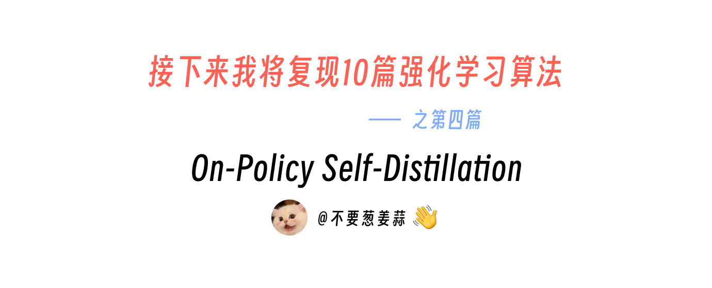
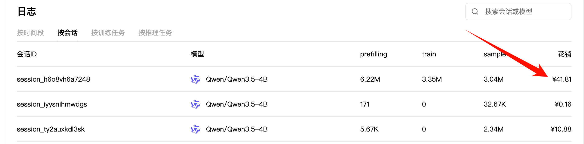
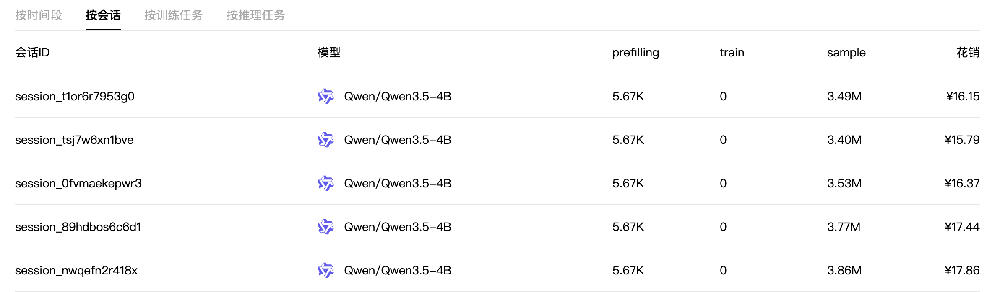
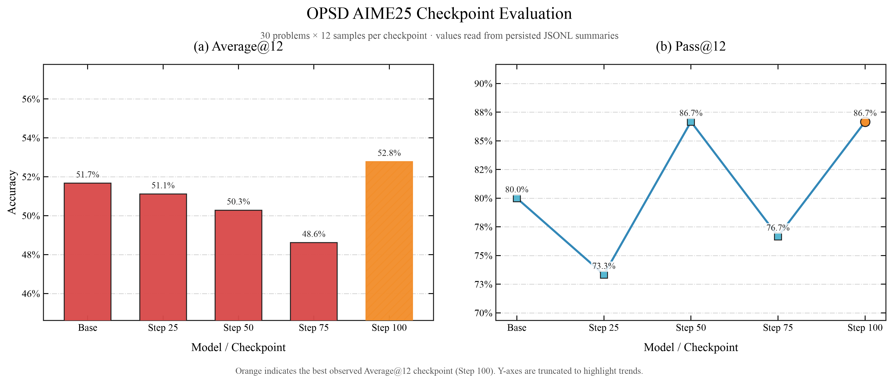
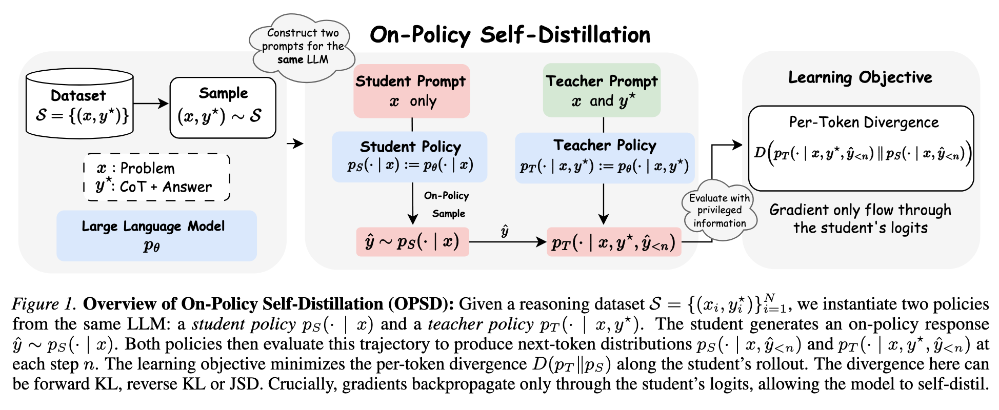
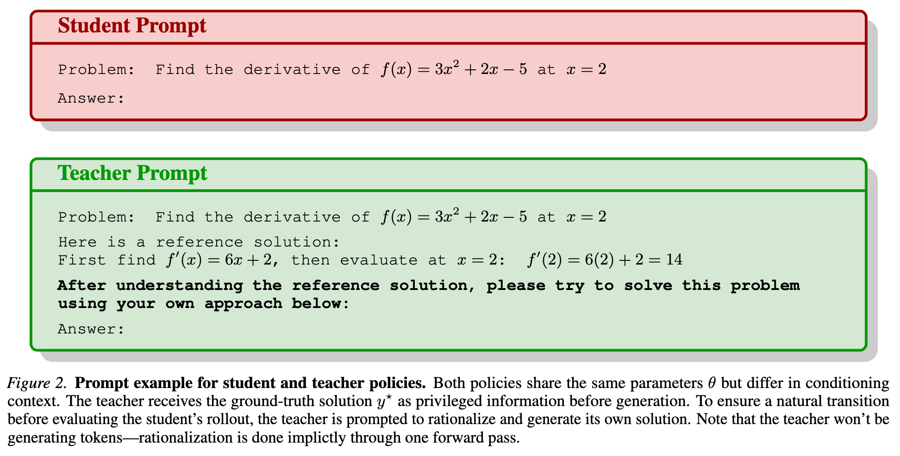
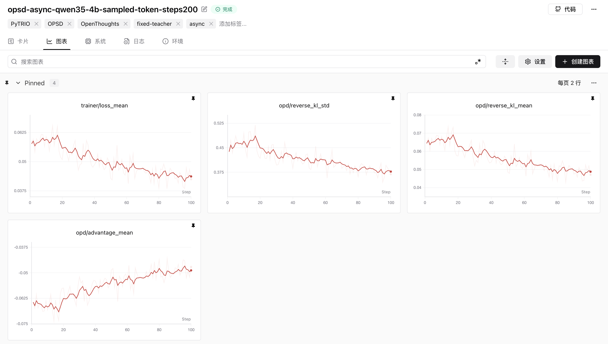

# 接下来我将复现 10 篇强化学习算法：第 4 篇，一顿疯狂星期四，搞定 OPSD



<div align="center">
  <a href="https://www.zhihu.com/people/feng-qi-xia-pian" target="_blank"></a>
  <a href="https://www.xiaohongshu.com/user/profile/63c2055e000000002502c58c" target="_blank"></a>
  <a href="https://github.com/KMnO4-zx/llm-agent-rl-lab"></a>
</div>

> **代码与复现资源**
>
> - 本文完整代码：[KMnO4-zx/llm-agent-rl-lab/04-opsd](https://github.com/KMnO4-zx/llm-agent-rl-lab/tree/main/04-opsd)
> - 异步 OPSD 训练脚本：[01-opsd-async.py](https://github.com/KMnO4-zx/llm-agent-rl-lab/blob/main/04-opsd/01-opsd-async.py)
> - SwanLab 训练记录：[查看完整实验曲线](https://swanlab.cn/@kmno4/llm-agent-rl-lab-opsd/runs/pxsnuza4/chart)
> - OPSD 论文：[Self-Distilled Reasoner: On-Policy Self-Distillation for Large Language Models](https://arxiv.org/abs/2601.18734)
> - OPSD 官方实现：[siyan-zhao/OPSD](https://github.com/siyan-zhao/OPSD)
> - PyTRIO 文档：[https://docs.pytrio.com/docs](https://docs.pytrio.com/docs)
> - PyTRIO 是什么？：[知乎介绍](https://zhuanlan.zhihu.com/p/2063265307226019219)
> - PyTRIO Skill：[SwanHubX/pytrio-skill](https://github.com/SwanHubX/pytrio-skill)

这是“接下来我将复现 10 篇强化学习算法”系列的第四篇。

前面几篇分别讲了：

- [第 0 篇：强化学习基础——损失函数](https://github.com/KMnO4-zx/llm-agent-rl-lab/blob/main/00-loss-function/readme.md)
- [第 1 篇：GRPO](https://github.com/KMnO4-zx/llm-agent-rl-lab/blob/main/01-grpo/readme.md)
- [第 2 篇：OPD](https://github.com/KMnO4-zx/llm-agent-rl-lab/blob/main/02-opd/readme.md)
- [第 3 篇：一杯喜茶，搞定 Search-R1](https://github.com/KMnO4-zx/llm-agent-rl-lab/blob/main/03-search-r1/readme.md)

这次想做的是一篇刚刚放出来不久、思路又特别漂亮的工作：**OPSD，On-Policy Self-Distillation**。

翻译成人话就是：

> 不找一个更大的 Teacher，直接让同一个模型一边闭卷答题，一边拿着参考答案给自己判卷。

前面几篇复现里，我已经用 PyTRIO 跑过 GRPO、OPD 和 Search-R1，对这套开发方式并不陌生。这一次真正想验证的是：面对一篇刚发布不久的 OPSD，能不能继续把时间集中在双 prompt、Teacher logprob 和 sampled-token loss 这些算法问题上。最后从读论文、写代码，到跑完 100 step、评测 Base Model 和 4 个 checkpoint、画出结果，整个过程没有超过两天。

正式训练会话的 PyTRIO 花销是 `41.81` 元：



这里的 `41.81` 元只计算 100-step 正式训练，不包含后面的完整 AIME25 评测。

评测反而是这次实验里更贵的一部分。我们需要分别评测 Base Model、Step 25、Step 50、Step 75 和 Step 100，一共 5 个模型状态。每次评测包含：

```text
30 道题 × 每题 12 次采样 = 360 条 completions
每条 completion 的 max_tokens = 38,912
```

因此，每个模型状态的最大生成预算是：

```text
30 × 12 × 38,912 = 14,008,320 tokens
```

`14.01M` 是上限，不是实际花销。模型通常会在达到 `max_tokens` 前生成 EOS，所以截图中的实际 sample 消耗为每次 `3.40M～3.86M tokens`：



| 评测对象 | 实际 sample tokens | 花销 |
| --- | ---: | ---: |
| Base Model | 3.49M | ¥16.15 |
| Step 25 | 3.40M | ¥15.79 |
| Step 50 | 3.53M | ¥16.37 |
| Step 75 | 3.77M | ¥17.44 |
| Step 100 | 3.86M | ¥17.86 |
| **5 次评测合计** | **18.05M** | **¥83.61** |

把正式训练和这 5 次完整评测放在一起，明确可归属的花销是 `41.81 + 83.61 = 125.42` 元。

所以标题里的“一顿疯狂星期四”，指的是把 OPSD 训练跑起来：四十多块钱确实跑通了一条完整训练链路；为了得到 Base + 4 个 checkpoint 的完整 Pass@12 曲线，评测成本会更高。

## 复现结果

我们固定使用 30 道题，每道题采样 12 次；Base Model 和所有 checkpoint 使用完全相同的评测配置：

```text
temperature = 1.0
top_p = 1.0
top_k = -1
max_tokens = 38,912
thinking = off
```

结果如下：



| 模型 / Checkpoint | Average@12 | Pass@12 | 正确 generations | 至少答对一次的题目 | Format Rate |
| --- | ---: | ---: | ---: | ---: | ---: |
| Qwen3.5-4B Base | 51.67% | 80.00% | 186 / 360 | 24 / 30 | 100% |
| Step 25 | 51.11% | 73.33% | 184 / 360 | 22 / 30 | 100% |
| Step 50 | 50.28% | 86.67% | 181 / 360 | 26 / 30 | 100% |
| Step 75 | 48.61% | 76.67% | 175 / 360 | 23 / 30 | 100% |
| **Step 100** | **52.78%** | **86.67%** | **190 / 360** | **26 / 30** | **100%** |

这里的两个指标分别表示：

- **Average@12**：360 条 generation 里有多少条最终答对；
- **Pass@12**：30 道题里，有多少题在 12 次采样中至少答对过一次。

Step 100 是这组实验里 Average@12 最好的 checkpoint：

```text
Average@12: 51.67% → 52.78%  （+1.11 个百分点）
Pass@12:    80.00% → 86.67%  （+6.67 个百分点）
```

换成更直观的数字，就是正确 generation 从 `186` 增加到 `190`，至少答对一次的题目从 `24` 道增加到 `26` 道。

这个提升是正的，但并不大。中间 checkpoint 也不是单调上升：Step 75 的 Average@12 甚至低于 Base Model。因此这组结果更适合说明：

> OPSD 的完整训练链路确实跑通了，最终 checkpoint 在当前评测上得到小幅正向变化；但 30 道题、单次训练、没有多随机种子的实验，还不足以宣称稳定复现了论文收益。

## OPSD 是什么

OPSD 来自 Siyan Zhao 等人的论文：

> Self-Distilled Reasoner: On-Policy Self-Distillation for Large Language Models

论文想解决两个很实际的问题。

第一个问题来自 SFT。

SFT 训练时，模型看到的是专家写好的标准轨迹：

```text
problem → expert solution
```

但是推理时，模型真正面对的是自己已经生成出来的 token。它可能在第三步就走错了，后面看到的上下文也会越来越偏。训练时从没见过这些“自己的错误状态”，推理时却必须处理它们，这就是典型的 off-policy distribution mismatch。

第二个问题来自 GRPO 一类 RLVR。

GRPO 可以在模型自己的 rollout 上学习，但通常只在整条回答结束后获得一个结果奖励：

```text
答对 → 1
答错 → 0
```

一条上千 token 的推理轨迹，最终只有一个稀疏信号。如果同一道题的 8 条轨迹全对或者全错，group-relative advantage 还会整体变成 0。

OPSD 的想法是把两者结合起来：

- rollout 必须由当前 Student 自己生成，保持 on-policy；
- Teacher 沿着 Student 的这条真实轨迹，在每一个 token 位置提供监督；
- Teacher 不需要是一个更大的模型，它和 Student 来自同一个初始模型；
- 两者的差别，只是 Teacher 能看到参考解答，Student 看不到。

论文里的完整流程是这样的：



可以把它想成同一个学生在做两件事。

第一次是闭卷：

```text
Student：只看题目，自己尝试解题。
```

第二次是开卷判卷：

```text
Teacher：看到题目、参考解答，以及 Student 已经写出的前缀，
         判断 Student 的下一个 token 是否合理。
```

这里最容易误解的一点是：

> Teacher 不会重新生成一条答案。整条轨迹只有 Student 生成一次，Teacher 只是对 Student 已经生成的 token 做一次 forward，计算它们的 logprob。

因此，它仍然是严格的 on-policy 学习。训练发生在当前 Student 真正访问到的 token 前缀上，而不是拿一批固定的专家答案做模仿。

## 同一个模型，为什么会同时有 Student 和 Teacher？

关键在 prompt。

Student 和 Teacher 使用同一个 Qwen3.5-4B tokenizer，也来自同一个初始模型，但上下文不同：



Student prompt 只有题目和输出要求：

```text
Problem: {problem}

Please reason step by step, and put your final answer within \boxed{}.
```

Teacher prompt 会额外加入数据集中的参考解答：

```text
Problem: {problem}

Here is a reference solution to this problem:
=== Reference Solution Begin ===
{solution}
=== Reference Solution End ===

请理解上面的推理，但不要直接复制；用自己的方式推导同一个答案。
```

真实实现位于 [`build_student_prompt_ids()` 和 `build_teacher_prompt_ids()`](https://github.com/KMnO4-zx/llm-agent-rl-lab/blob/main/04-opsd/01-opsd-async.py#L279-L305)。

参考解答并不是让 Teacher 输出一份新的标准答案，而是作为 privileged information 改变 Teacher 对“下一个 token”的判断。

举个极简例子。假设 Student 已经写到：

```text
f'(x) = 6x + 2, so at x = 2 ...
```

Student 只能根据题目和自己的推理前缀，判断下一个 token 是什么；Teacher 已经看过参考解答，因此可能对正确的 `14` 给出更高概率，对错误分支给出更低概率。

这就是所谓的“同一个模型教自己”：Teacher 的能力不是来自更多参数，而是来自更多上下文。

## OPSD 和 SFT、GRPO、普通 OPD 有什么区别？

| 方法 | 训练轨迹来自哪里 | 监督信号 | Teacher | 是否在 Student 自己的状态上学习 |
| --- | --- | --- | --- | --- |
| SFT | 固定专家轨迹 | token-level CE | 不需要在线 Teacher | 否 |
| GRPO | 当前策略 rollout | sequence-level reward | Reward / Verifier | 是 |
| 普通 OPD | 当前 Student rollout | Teacher token logprob | 独立 Teacher 模型 | 是 |
| OPSD | 当前 Student rollout | privileged Teacher token logprob | 同一个初始模型，不同 prompt | 是 |

OPSD 最漂亮的地方，就是同时保留了三件事：

1. **On-policy**：训练数据来自 Student 当前会生成的内容；
2. **Dense feedback**：每一个 completion token 都有 Teacher 信号；
3. **Self-distillation**：不需要再部署一个更大的 Teacher 模型。

## 这次复现的目标函数是什么？

论文给出了两种实现 OPSD 的方式。

第一种是 full-vocabulary logit distillation：在每一个位置拿到 Teacher 和 Student 对整个词表的分布，再计算 JSD 或 KL。论文主实验使用 `JSD β=0.5`，后续官方代码还加入了 point-wise KL clipping，避免少数风格 token 支配训练信号。

第二种是 sampled-token distillation：只计算 Student 实际采样 token 在两个策略下的 logprob，再把两者的差作为 token-level advantage。

本文使用的是第二种。

对于 Student 在位置 `t` 实际采样出的 token `ŷ_t`：

```text
reverse_kl_t = log p_S(ŷ_t | x, ŷ_<t>)
             - log p_T(ŷ_t | x, y*, ŷ_<t>)

advantage_t  = -β × reverse_kl_t
             = β × (log p_T - log p_S)
```

代码就是两行：

```python
reverse_kl = np.asarray(student_lps) - np.asarray(teacher_lps)
advantages = -args.kl_penalty_coef * reverse_kl
```

完整位置见 [`run_prompt_rollout_async()`](https://github.com/KMnO4-zx/llm-agent-rl-lab/blob/main/04-opsd/01-opsd-async.py#L373-L468)。

如果 Teacher 比 Student 更认可这个 token，那么 `log p_T - log p_S` 为正，这个 token 会被鼓励；如果 Teacher 更不认可，它就会被压低。

## 本文复现 Config

本次实验配置如下：

| 项目 | 本文实现 |
| --- | --- |
| Base Model | `Qwen/Qwen3.5-4B` |
| Student | LoRA rank 64；训练 attention + MLP |
| Teacher | 固定的 step-0 `Qwen/Qwen3.5-4B` |
| 训练数据 | `siyanzhao/Openthoughts_math_30k_opsd` |
| 数据量 | 29,434 对 `problem + solution` |
| 实际分析区间 | 100 steps |
| 每个 step | 32 道问题 |
| 每道问题 | 1 条 Student completion |
| 最大 completion | 1,024 tokens |
| 最大远程并发 | 32 |
| Student / Teacher thinking | 均关闭 |
| Sampling | temperature 1.1 / top-p 0.95 / top-k 20 |
| KL coefficient | 1.0 |
| Learning rate | `5e-6` |
| Sampler refresh | 每 step 刷新，严格 on-policy |
| Loss | `importance_sampling` |
| Checkpoint | 每 25 step 保存 state + sampler weights |

训练 run 最初把上限写成了 200 step，所以 SwanLab 截图中的名字仍然带有 `steps200`；本文只分析实际完成并持久化的前 100 step，复现命令也直接写成 100 step，避免歧义。

## 为什么用 PyTRIO 可以在两天内做完？

如果你是第一次接触 PyTRIO，可以先看这篇知乎文章：[PyTRIO 是什么？](https://zhuanlan.zhihu.com/p/2063265307226019219)。下面只结合这次 OPSD 复现，讲它具体省掉了哪些工作。

OPSD 官方实现使用 TRL 的 experimental GOLD Trainer 和 Accelerate；环境安装还包括 Conda 与 FlashAttention，评测脚本使用 vLLM。论文中的实验则运行在 `8×A100` 上。

如果从一台普通开发机开始，按照这套官方方案复现，需要先处理一整套基础设施：

```text
CUDA / PyTorch 版本
FlashAttention
FSDP 或其他分布式策略
vLLM / SGLang rollout
训练权重与推理权重同步
多卡资源调度
checkpoint 与恢复
```

这些框架并不是不好。相反，它们非常适合有固定 GPU 集群、需要深入控制分布式执行的团队。

但这篇 Blog 的目标是：我想先在两天内知道 OPSD 到底能不能工作，而不是先把两天全部花在环境上。

PyTRIO 把分工切得很清楚：

| 本地 Python 负责 | PyTRIO 远端负责 |
| --- | --- |
| 下载和读取数据 | Student sampling |
| 构造 Student / Teacher prompt | Teacher logprob forward |
| `asyncio` 并发与 batch 编排 | LoRA forward / backward |
| 计算 reverse KL 和 advantage | optimizer step |
| SwanLab 记录与实验分析 | state / sampler weights 保存 |

本地机器不需要 GPU。这次 run 的 SwanLab 元数据记录的是一台 `Apple M4` 的 MacBook Air；训练和采样请求通过 PyTRIO 远端执行。

100 个 step 的 `time/step_elapsed_time` 累计约 `7,540.6` 秒，也就是约 `2 小时 6 分钟`。这不包含数据准备和完整 AIME25 评测，但已经足够说明：从写好算法到拿到一个可评测 checkpoint，中间不需要先租和维护一套多卡机器。

对我来说，真正节省的还不是这两个小时，而是前面的环境时间。我可以直接把精力放在这些问题上：

```text
Teacher 到底应该看到什么？
Teacher 能不能生成新 token？
Student 和 Teacher 的 logprob 如何逐 token 对齐？
prompt 区间为什么必须 mask？
什么时候刷新 Student sampler 才算严格 on-policy？
```

这些才是复现 OPSD 真正应该花时间理解的地方。

## OPSD 的异步训练闭环

下面开始结合真实代码拆训练流程。

完整异步脚本在：

> [`04-opsd/01-opsd-async.py`](https://github.com/KMnO4-zx/llm-agent-rl-lab/blob/main/04-opsd/01-opsd-async.py)

一次训练 step 可以压缩成下面这段伪代码：

```python
for step in range(total_steps):
    student_sampler = refresh_latest_student_weights()

    rollouts = await asyncio.gather(
        *[
            student_sample_then_teacher_score(problem)
            for problem in batch
        ]
    )

    datums = build_importance_sampling_datums(rollouts)
    await forward_backward(datums)
    await optim_step()
```

看上去很短，但里面有几个非常关键的对齐关系。

## 第一步：准备 `problem + solution` 数据

数据下载脚本是 [`00-datasets.py`](https://github.com/KMnO4-zx/llm-agent-rl-lab/blob/main/04-opsd/00-datasets.py)。

训练集使用论文作者公开的 [`siyanzhao/Openthoughts_math_30k_opsd`](https://huggingface.co/datasets/siyanzhao/Openthoughts_math_30k_opsd)，固定 revision 后一共 `29,434` 条，每条至少包含：

```text
problem   # Student 和 Teacher 都能看到
solution  # 只有 Teacher 能看到
```

这里的 `solution` 不是 SFT label。

训练不会直接把它拼到 Student 的 target 中，而是只用它改变 Teacher 的条件分布。Student 真正学习的 token，仍然来自 Student 自己的 rollout。

## 第二步：创建可训练 Student 和固定 Teacher

对应代码在 [`train()`](https://github.com/KMnO4-zx/llm-agent-rl-lab/blob/main/04-opsd/01-opsd-async.py#L558-L616)：

```python
training_client = await service_client.create_lora_training_client_async(
    base_model=args.base_model,
    rank=args.lora_rank,
    train_attn=True,
    train_mlp=True,
    train_unembed=False,
)

teacher_client = await service_client.create_sampling_client_async(
    base_model=args.base_model,
)
```

Student 和 Teacher 都从 `Qwen/Qwen3.5-4B` 开始。

区别是：

- Student 挂着可训练 LoRA；
- Teacher 不传 `model_path`，永远保持 step-0 base policy；
- 每个 step 结束只更新 Student；
- Teacher 没有 optimizer，也不会跟着 Student 漂移。

固定 Teacher 很重要。否则 Teacher 和 Student 一起更新，监督目标也会不断移动，训练更容易不稳定。

## 第三步：让 Student 先生成 on-policy 轨迹

每个 step 开始时，先拿到最新 Student 权重对应的 sampler：

```python
student_sampler = (
    await training_client.save_weights_and_get_sampling_client_async()
)
```

然后 Student 只看题目进行采样：

```python
sample_result = await student_sampler.sample_async(
    prompt=student_prompt,
    num_samples=1,
    sampling_params=sampling_params,
    return_text=False,
)
```

本文每道题只采样一条 completion，最大长度 1,024 tokens。

`sampler_refresh_steps=1` 表示每完成一次 optimizer update，下一 step 都重新刷新 sampler。因此新一批 rollout 始终来自最新 Student，而不是一个落后很多步的旧策略。

这就是“on-policy”在代码里的实际含义。

## 第四步：Teacher 只给同一条 Student completion 打分

Student 生成完成后，Teacher 收到的是：

```text
teacher_prompt_ids + student_completion_ids
```

代码位于 [`teacher_completion_logprobs_async()`](https://github.com/KMnO4-zx/llm-agent-rl-lab/blob/main/04-opsd/01-opsd-async.py#L308-L330)：

```python
all_ids = teacher_prompt_ids + completion_ids
all_logprobs = await teacher_client.compute_logprobs_async(
    trio.ModelInput.from_ints(all_ids)
)
teacher_logprobs = all_logprobs[len(teacher_prompt_ids):]
```

注意这里调用的是 `compute_logprobs_async()`，不是 `sample_async()`。

Teacher 没有生成另一条轨迹。它只是换了一份包含参考解答的 prompt，对 Student 的原始 completion 做 teacher forcing forward，并截取 completion 区间的 logprob。

因此三者必须严格等长：

```text
Student completion tokens
Student rollout logprobs
Teacher completion logprobs
```

只要有一个 token 对不上，reverse KL 就没有意义。代码会直接检查长度和 `None`，而不是悄悄截断。

## 第五步：把 logprob 差变成逐 token advantage

对于同一个 Student token：

```python
reverse_kl = student_logprobs - teacher_logprobs
advantages = -kl_penalty_coef * reverse_kl
```

它和 GRPO 最大的区别在这里。

GRPO 的 advantage 来自同一道题多条 rollout 的最终 reward 差；OPSD 的 advantage 来自 Teacher 与 Student 在每一个 token 上的 logprob 差。

因此 OPSD 不需要等模型生成完整答案，也不需要先判断最终答案是否正确。哪怕 Student 的最终结果是错的，只要 Teacher 对中间 token 的偏好不同，这条轨迹仍然能产生训练信号。

当然，这也意味着 Teacher 是否真的理解参考解答非常重要。模型太弱、题目太难时，privileged context 并不会自动变成可靠监督。

## 第六步：只训练 completion，prompt 全部 mask

PyTRIO 的 `importance_sampling` Datum 需要：

```text
model_input
target_tokens
old logprobs
advantages
```

对应实现见 [`build_opd_datum()`](https://github.com/KMnO4-zx/llm-agent-rl-lab/blob/main/04-opsd/01-opsd-async.py#L333-L371)。

核心逻辑如下：

```python
input_ids = student_prompt_ids + completion_ids[:-1]

target_tokens = [0] * prompt_loss_len + completion_ids
old_logprobs = [0.0] * prompt_loss_len + student_logprobs
advantages = [0.0] * prompt_loss_len + token_advantages
```

prompt 区间的 `target_tokens`、`logprobs` 和 `advantages` 都填 0，只作为上下文存在，不参与优化。

真正进入 loss 的只有 Student 自己生成的 completion token。

这里还做了标准的自回归右移：`model_input` 去掉最后一个 completion token，`target_tokens` 则保留完整 completion，保证位置 `t` 的输入预测位置 `t+1` 的目标。

## 第七步：用 `asyncio.gather` 并发整批 rollout

OPSD 一道题至少需要两类远程请求：

1. Student sample；
2. Teacher compute logprobs。

如果 32 道题完全串行执行，大量时间会浪费在网络和远程任务等待上。

异步版在单题内部先完成 Student→Teacher 的依赖，再在题目之间并发：

```python
rollouts = await asyncio.gather(
    *(rollout_and_track(row) for row in batch)
)
```

同时使用一个 `asyncio.Semaphore(32)` 统一限制 Student sampling 和 Teacher scoring 的总并发，避免一次提交过多请求。

完整逻辑见 [`run_prompt_rollout_async()`](https://github.com/KMnO4-zx/llm-agent-rl-lab/blob/main/04-opsd/01-opsd-async.py#L373-L468) 和 [`train()` 中的 batch gather](https://github.com/KMnO4-zx/llm-agent-rl-lab/blob/main/04-opsd/01-opsd-async.py#L623-L666)。

这里的并发不会破坏 on-policy：当前 batch 的所有 rollout 都基于同一个 Student checkpoint，全部完成后才进行一次 optimizer update。

## 第八步：一次 forward/backward，再更新 Student

当前 step 的全部 Datum 展平后，只提交一次训练更新：

```python
fwd_bwd_future = await training_client.forward_backward_async(
    datums,
    loss_fn="importance_sampling",
)
optim_future = await training_client.optim_step_async(adam)

await fwd_bwd_future
await optim_future
```

完整位置见 [`01-opsd-async.py#L670-L699`](https://github.com/KMnO4-zx/llm-agent-rl-lab/blob/main/04-opsd/01-opsd-async.py#L670-L699)。

PyTRIO 负责远端的 forward、backward、梯度累积与 LoRA optimizer；本地代码仍然完全控制 rollout、advantage、batch 边界和更新时机。

等 optimizer 真正完成后，代码才进入下一 step，并刷新 Student sampler。

## SwanLab 训练记录

我们把 Trainer loss、reverse KL、advantage、token 数和耗时记录到了 SwanLab。下面是部分曲线截图，[完整训练记录可以在这里查看](https://swanlab.cn/@kmno4/llm-agent-rl-lab-opsd/runs/pxsnuza4/chart)：



在前 100 step 中：

```text
trainer/loss_mean:    0.0577 → 0.0425
reverse_kl_mean:      0.0644 → 0.0471
reverse_kl_std:       0.4378 → 0.3687
```

这说明 Student 和 privileged Teacher 在 Student 采样 token 上的差异整体收缩了，训练目标确实在被优化。

`opd/advantage_mean` 是负数并不奇怪。因为我们定义：

```text
advantage = -(student_logprob - teacher_logprob)
```

当 Student 在自己的采样分布下，平均比 Teacher 更偏好这些 token 时，sampled reverse KL 为正，平均 advantage 就会为负。

但是要注意：

> loss 和 reverse KL 下降，只能说明 Student 正在靠近 Teacher，不能直接证明数学能力一定提高。

最终能力仍然要看独立 benchmark。本文的 AIME25 曲线也证明了这一点：训练目标在稳定下降，checkpoint 准确率却会波动。

## 如何运行这次复现？

### 1. 安装项目并登录

```bash
git clone https://github.com/KMnO4-zx/llm-agent-rl-lab.git
cd llm-agent-rl-lab

uv sync
trio login
swanlab login
```

本地只需要 CPU 环境。模型采样与 LoRA 训练由 PyTRIO 远端执行。

### 2. 下载 OPSD 和 AIME25 数据

```bash
uv run python 04-opsd/00-datasets.py
```

脚本会下载并校验：

```text
04-opsd/datasets/
├── openthoughts_math_30k_opsd/   # 29,434 条训练数据
└── aime_2025/                     # 30 道评测题
```

两份数据都固定了 Hugging Face revision，避免上游更新后实验数据静默变化。

### 3. 运行 100-step 异步 OPSD

```bash
uv run python 04-opsd/01-opsd-async.py \
    --steps 100 \
    --batch-size 32 \
    --group-size 1 \
    --max-tokens 1024 \
    --sample-size 0 \
    --save-every-steps 25 \
    --max-concurrency 32 \
    --swanlab-mode online
```

每 25 step 会保存两份内容：

```text
*-state            # 包含优化器状态，用于断点续训
*-sampler_weights  # 用于采样和 AIME25 评测
```

### 4. 评测 Base Model

```bash
uv run python 04-opsd/00-eval-aime25.py \
    --val-n 12 \
    --max-tokens 38912 \
    --temperature 1.0 \
    --enable-thinking false \
    --output 04-opsd/eval-results/aime25-base.jsonl
```

### 5. 评测 OPSD checkpoint

把训练日志中 `save_weights_for_sampler` 返回的 `trio://` 路径填进去：

```bash
uv run python 04-opsd/00-eval-aime25.py \
    --val-n 12 \
    --max-tokens 38912 \
    --temperature 1.0 \
    --enable-thinking false \
    --model-path trio://<your_sampler_weights_path> \
    --output 04-opsd/eval-results/aime25-sampler-steps100.jsonl
```

评测脚本会为每道题保存 12 条生成结果，并在 JSONL 最后一行写入统一 summary。

### 6. 绘制 checkpoint 对比图

当 `eval-results/` 中已经存在 Base、Step 25、50、75、100 的 JSONL 后：

```bash
uv run python 04-opsd/analysis.py
```

结果会写到：

```text
04-opsd/images/aime25-opsd-progress.png
```

## 小结

OPSD 是我最近看到最像“人类复盘”过程的一种训练方法。

Student 先闭卷写出自己真正会写的东西；Teacher 再拿着参考答案，沿着 Student 的原始思路逐 token 判断哪里应该被鼓励、哪里应该被压低。Teacher 不需要更大，也不需要重新写一份答案，只需要在更有信息的上下文里做一次 forward。

这次我们用 Qwen3.5-4B、29,434 条 OpenThoughts 数学数据和 PyTRIO 跑了 100 step。正式训练花了 `41.81` 元，Base + 4 个 checkpoint 的完整 AIME25 评测另外花了 `83.61` 元；累计 step 时间约 `2 小时 6 分钟`。Step 100 的 AIME25 Average@12 从 `51.67%` 提升到 `52.78%`，Pass@12 从 `80.00%` 提升到 `86.67%`。

结果不算巨大，中间也有明显波动。但对我来说，这篇复现最重要的成果并不是多了几个百分点，而是我确实可以在两天内把一篇新算法从论文公式变成：

```text
可运行代码
真实训练
可恢复 checkpoint
独立评测
完整实验记录
```

如果按照官方多卡训练栈从头准备，这两天很可能还在处理 CUDA、FlashAttention、rollout engine 和权重同步。PyTRIO 让我把这段时间真正花在了 Student / Teacher prompt、token 对齐、advantage 和 on-policy 边界上。

## 参考资料

### 论文与官方实现

1. Siyan Zhao et al. [Self-Distilled Reasoner: On-Policy Self-Distillation for Large Language Models](https://arxiv.org/abs/2601.18734), 2026.
2. [siyan-zhao/OPSD](https://github.com/siyan-zhao/OPSD)
3. Siyan Zhao. [Self-Distilled Reasoner: On-Policy Self-Distillation](https://siyan-zhao.github.io/blog/2026/opsd/)

### 数据与模型

1. [siyanzhao/Openthoughts_math_30k_opsd](https://huggingface.co/datasets/siyanzhao/Openthoughts_math_30k_opsd)
2. [yentinglin/aime_2025](https://huggingface.co/datasets/yentinglin/aime_2025)
3. [Qwen/Qwen3.5-4B](https://huggingface.co/Qwen/Qwen3.5-4B)

### 本文实现

1. [OPSD PyTRIO 完整代码](https://github.com/KMnO4-zx/llm-agent-rl-lab/tree/main/04-opsd)
2. [PyTRIO 文档](https://docs.pytrio.com/docs)
3. [PyTRIO 是什么？——知乎介绍](https://zhuanlan.zhihu.com/p/2063265307226019219)
4. [PyTRIO On-Policy Distillation 示例](https://docs.pytrio.com/docs/example/opd)
5. [本文的 SwanLab 训练记录](https://swanlab.cn/@kmno4/llm-agent-rl-lab-opsd/runs/pxsnuza4/chart)
6. [SwanLab 文档](https://docs.swanlab.cn/)
