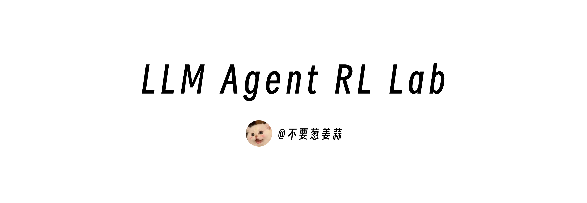

<div align="center">

<a href="https://github.com/KMnO4-zx/llm-agent-rl-lab">
  
</a>

<h1><i>LLM Agent RL Lab</i></h1>

<p>
  复现和拆解前沿 LLM 强化学习算法，用更简单的代码和更低的 GPU 门槛，把 GRPO、OPD、GSPO、DAPO、OPD、Slime 等方法跑起来，方便复现。
</p>

<p>
  
  
  <a href="https://pytrio.cn/"></a>
  <a href="https://swanlab.cn/"></a>
  
  
</p>

</div>

## 这个仓库是什么？

这是一个偏实验记录和教程的仓库。我会用 PyTRIO 复现一组和 LLM / Agent RL 相关的强化学习算法，并尽量把每一篇都写成两部分：

1. 先把算法讲明白：它从哪篇论文来，解决什么问题，核心变量是什么。
2. 再用可运行代码复现：数据、reward、loss、训练循环、SwanLab 记录都放在仓库里。
3. 可能未来会做一个更友好和轻量的 Agent RL 训练框架～

我选择 PyTRIO 的原因很简单：研究这些算法时，我更想比较 loss、reward、group size、学习率和采样参数，而不是先维护一套 8 卡训练服务。PyTRIO 把训练、采样、LoRA 权重保存和远端资源管理托管掉，本地代码就可以专注在实验逻辑上。

## 文章目录

| 篇章 | 主题 | 内容 |
| --- | --- | --- |
| [第 0 篇](./00-loss-function/readme.md) | Loss Function | 用直觉解释 `importance_sampling`、`ppo`、`cispo` 分别在优化什么 |
| [第 1 篇](./01-grpo/readme.md) | GRPO | 复现 GSM8K 上的 GRPO，并比较 `importance_sampling` / `ppo` / `cispo` 三个 loss |
| 第 2 篇 | OPD | On-Policy Distillation，待更新 |

## 快速启动

如果是直接 clone 这个仓库：

```bash
git clone https://github.com/KMnO4-zx/llm-agent-rl-lab.git
cd llm-agent-rl-lab
uv sync
```

如果只想把某个 demo 脚本拎到自己的项目里跑：

```bash
uv add "datasets>=5.0.0" "numpy>=2.5.1" "pytrio>=0.2.0" "swanlab>=0.8.4" "torch>=2.12.1" "tqdm>=4.68.3"
```

## 目录结构

```text
├── 00-loss-function/
│   ├── readme.md
│   └── images/
├── 01-grpo/
│   ├── 01-demo-sync.py
│   ├── 02-demo-async.py
│   ├── readme.md
│   └── images/
├── images/
│   └── llm-agent-rl-lab.png
├── pyproject.toml
└── README.md
```

## License

See [LICENSE](./LICENSE).
